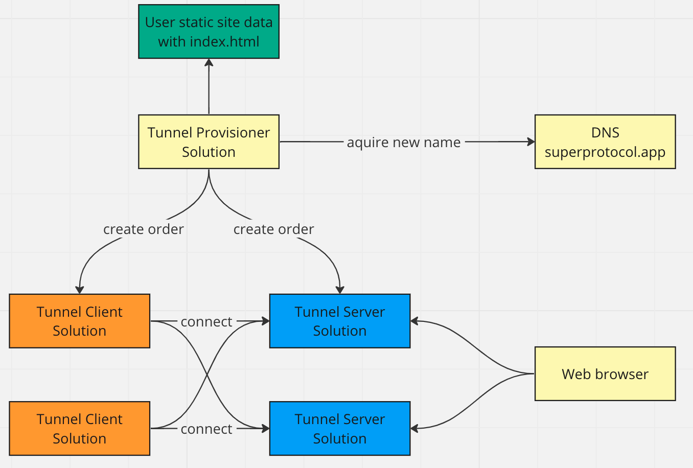

Tunnel Provisioner Solution - это решение, которое было создано для упрощения развертывания сайтов, в частности, статических сайтов. В общем, это инструмент, который автоматизирует процесс развертывания сайта, делая сам процесс более удобным и эффективным.

Ниже приведена его схема работы:

Работа этой системы включает в себя несколько этапов:

1. **Запуск решения с входными данными**: Исходные данные сайта передаются в формате архива в качестве входных данных, который содержит все необходимые файлы для работы статического сайта. Одним из обязательных файлов в архиве должен быть файл index.html, который служит основной страницей сайта.

2. **Выделение поддомена**: После получения данных, Tunnel Provisioner выделяет случайный поддомен на адресе *.superprotocol.app. Это значит, что в дальнейшем ваш сайт будет доступен по этому поддомену.

3. **Создание заказов**: Система создает четыре заказа: два на сервер туннеля и два на клиента туннеля. Это необходимо для установления связи между вашим сайтом и пользователями, а также отказоустойчивой работы вашего сайта.

4. **Выделение IP-адреса и создание записей DNS**: В процессе выполнения заказа, каждый сервер выделяет IP-адрес для внешних подключений. Затем, Tunnel Provisioner создает TXT и AAA записи в DNS, связанные с данными адресами. Записи AAA служат для активации внешних подключений, а специальные TXT записи служат для установления связи между клиентом и сервером туннеля.

5. **Возврат результатов**: В конце этого процесса, Tunnel Provisioner возвращает созданный домен и информацию о созданных заказах. Также возвращается приватный ключ, который можно использовать для получения результатов по этим заказам, если это необходимо.