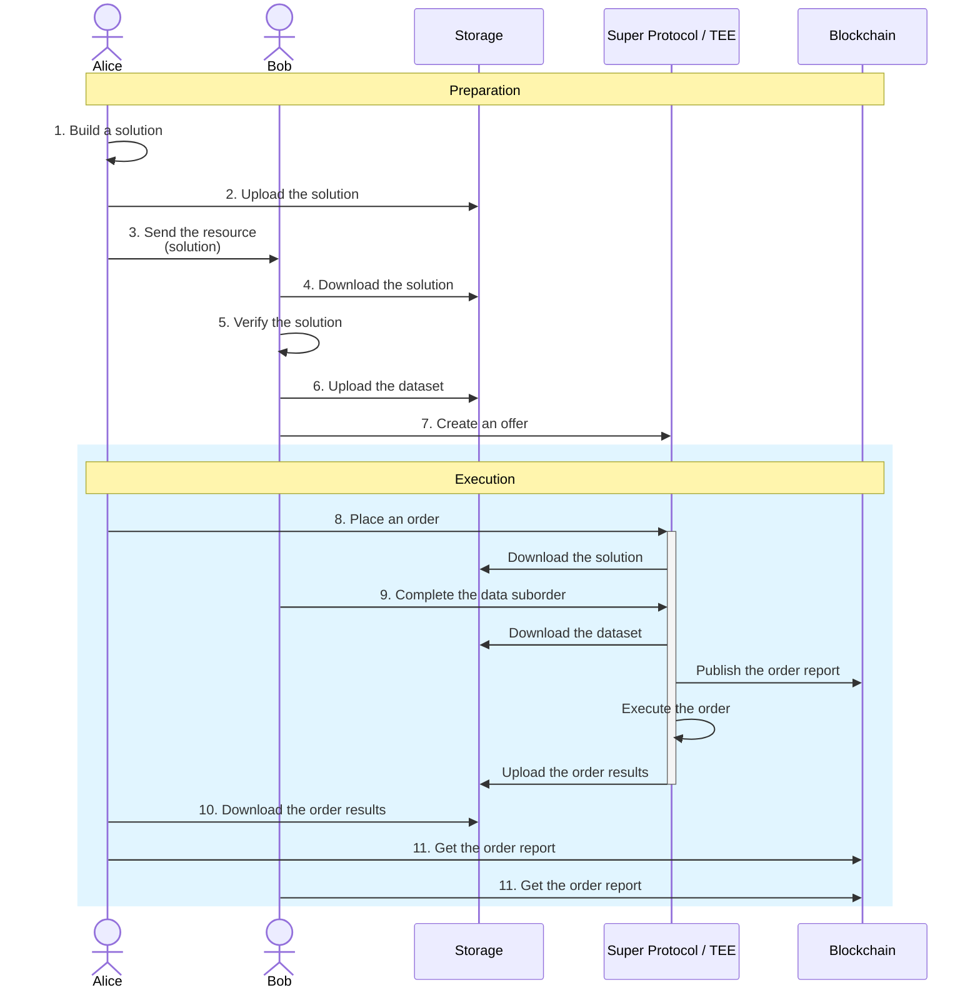

Super Protocol enables independent parties to jointly compute over their private inputs without revealing those inputs to one other.

This guide describes a simple example of confidential collaboration between two parties, **Alice** and **Bob**. Alice owns a script she wants to use to process Bob's dataset. However, the dataset contains sensitive information and cannot be shared.

The computation runs on Super Protocol within a <a id="tee"><span className="dashed-underline">Trusted Execution Environment</span></a> that is is isolated from all external access, including by Alice, Bob, the hardware owner, and the Super Protocol team. Additionally, Super Protocol's Certification System ensures verifiability, eliminating the need for trust.

Note that this is just one example; Super Protocol's architecture enables a range of more complex multiparty scenarios.

## General workflow


<br/>

**Preparation**:

Alice builds a <a id="solution"><span className="dashed-underline">solution</span></a>—a Docker image containing her script (1). She uploads the solution using SPCTL (2) and grants Bob access for verification (3).

Bob downloads the solution (4) and verifies it is safe to process his data (5).

Bob uploads his dataset to remote storage using SPCTL (6). The dataset is automatically encrypted during upload, and only Bob holds the key.

Bob creates an <a id="offer"><span className="dashed-underline">offer</span></a> on the Marketplace (7). The offer require Bob's manual approval for use. He shares the offer's IDs with Alice.

**Execution**:

Alice places an <a id="order"><span className="dashed-underline">order</span></a> on Super Protocol using her solution and Bob's offer ID (8). The order remains **Blocked** by the data suborder.

Bob manually completes the data suborder (9). The command includes the verified solution hash. Completion succeeds only if this hash matches the actual solution hash, meaning the solution was not altered.

Once the computation finishes, Alice can download the result (10).

Both Alice and Bob can retrieve the order report (11) that confirms the authenticity of the entire process.

## Prerequisites

### Alice

- [SPCTL](/cli)
- Docker

### Bob

- [SPCTL](/cli)
- Provider Tools

## Preparation

### Alice: 1. Build the solution

1.1. Prepare the solution: write a Dockerfile that creates an image with your software. Keep in mind the special file structure inside the <a id="tee"><span className="dashed-underline">TEE</span></a>:

| **Location**                                                      | **Purpose**                           | **Access** |
| :-                                                                | :-                                    | :- |
| `/sp/inputs/input-0001/`<br/>`/sp/inputs/input-0002/`<br/>etc.      | Possible data locations               | Read-only |
| `/sp/output/`                                                      | Output directory for results          | Write; read own files |
| `/sp/certs/`                                                       | Contains the order certificate        | Read-only |

Your scripts must find the data in `/sp/inputs/` and write the results to `/sp/output/`.

:::important

Always use absolute paths, such as `/sp/...`.

:::

You can find several Dockerfile examples in the [Super-Protocol/solutions](https://github.com/Super-Protocol/solutions) GitHub repository.

1.2. Build an image:

```shell
docker build -t <SOLUTION> .
```

Replace `<SOLUTION>` with the name of your solution.

1.3. Save and archive the image:

```shell
docker save <SOLUTION>:latest | gzip > <SOLUTION>.tar.gz
```

### Alice: 2. Upload the solution

```shell
./spctl files upload <SOLUTION>.tar.gz \
  --output solution.resource.json \
  --filename <SOLUTION>.tar.gz \
  --use-addon
```

### Alice: 3. Send the solution to Bob

Send Bob the output `solution.resource.json` file from the previous step.

### Bob: 4. Download the solution

```shell
./spctl files download solution.resource.json . --use-addon
```

### Bob: 5. Verify the solution

Review the image to ensure it is safe to process your data.

### Bob: 6. Upload the dataset

```shell
./spctl files upload <DATASET_DIR> \
  --output dataset.resource.json \
  --use-addon
```

Replace `<DATASET_DIR>` with the path to the dataset directory.

:::important

The uploaded content is encrypted. However, the output `dataset.resource.json` file contains information on how to access and decrypt it.
Be careful with sharing resource files if the uploaded content is sensitive.

:::

### Bob: 7. Create an offer

7.1. In the Provider Tools directory, create a file named `offer-info.json`. Paste the following:

```json title="offer-info.json"
{
   "name":"Offer name",
   "group":"0",
   "offerType":"3",
   "cancelable":false,
   "description":"Offer description",
   "restrictions":{
      "offers":[         
      ],
      "types":[         
      ]
   },
   "input":"",
   "output":"",
   "allowedArgs":"",
   "allowedAccounts":[      
   ],
   "argsPublicKey":"",
   "resultResource":"",
   "subType":"0",
   "version":{
      "version":1,
      "status":"0",
      "info":{
         "metadata":{
            "groupingOffers":true
         }
      }
   }
}
```

Modify the offer name and description; leave the rest intact. Save and close the file.

7.2. In the same directory, create a file named `slot-info.json`. Paste the following:

```json title="slot-info.json"
{
    "info": { "cpuCores": 0, "gpuCores": 0, "diskUsage": 10485760, "ram": 0, "vram": 0 },
    "usage": {
      "maxTimeMinutes": 0,
      "minTimeMinutes": 15000,
      "price": "0",
      "priceType": "1"
    },
    "option": { "bandwidth": 0, "externalPort": 0, "traffic": 0 }
}
```

Adjust the value set to `diskUsage` so that it is larger than the size of your dataset in bytes. Save and close the file.

7.3. Register an offer:

```shell
./provider-tools register data --result <DATASET_JSON>
```

Replace `<DATASET_JSON>` with the path to the `dataset.resource.json` file.

:::note

If you are registering an offer for the first time, you will be prompted to complete the provider setup. Enter a provider name and then a brief description. Save the provider information to a file when prompted.

:::

Follow the dialog:

Q: `Have you already created a DATA offer?`
A: `n` (No)

Q: `Please specify a path to the offer info json file`
A: `./offer-info.json`

Q: `Please specify a path to the slot info json file`
A: `./slot-info.json`

Q: `Do you want to add another slot?`
A: `n` (No)

Wait for the offer to be created and find a line in the output with the IDs of the offer and slot, for example:

```text
Slot 119654 for offer 18291 has been created successfully
```

Provide Bob with these IDs. Ignore other instructions you see in the output.

## Execution

### Alice: 8. Place an order

8.1. Place an order with your solution and Bob's data offer:

```shell
./spctl workflows create \
   --solution ./solution.resource.json \
   --data <OFFER_ID>,<SLOT_ID> \
   --tee <COMPUTE>
```

Replace:

- `<OFFER_ID>` with the offer ID provided by Bob
- `<SLOT_ID>` with the slot ID provided by Bob
- `<COMPUTE>` with the desired compute offer ID.

Find the order ID in the output, for example:

```shell
Workflow was created, TEE order id: ["260402"]
```

8.2. Get the suborder ID:

```shell
./spctl orders get <ORDER_ID> --suborders --suborders_fields id,type,status
```

Replace `<ORDER_ID>` with the order ID.

Provide Bob with the order ID and the `Data` suborder ID.

### Bob: 9. Complete the data suborder

Manually complete the data suborder:

```shell
./spctl orders complete <SUBORDER_ID> \
   --result ./dataset.resource.json \
   --status done \
   --solution-hash <SOLUTION_HASH>
```

Replace:

- `<SUBORDER_ID>` with the data suborder ID
- `<SOLUTION_HASH>` with the hash from the `solution.resource.json` file. If the solution was modified, its hash will not match the hash you enter. In this case, the suborder will not be completed, and the order will not proceed.

### Alice: 10. Download the order results

10.1. Check the order status:

```shell
./spctl orders get <ORDER_ID>
```

Replace `<ORDER_ID>` with the order ID.

10.2. When the status is `Done` or `Error`, download the result:

```shell
./spctl orders download-result <ORDER_ID>
```

If the order ended up with an error, the results will contain execution logs that may be useful for troubleshooting.

### Alice and Bob: 11. Get the order report

```shell
./spctl orders get-report <ORDER_ID> --save-to report.json
```

The report contains the full certificate chain, from the Root CA to the order certificate, and workload metadata.

Ensure you see `Order report validation successful!` in the output.

Additionally, find entries in the `runtimeInfo` array that start with `"type": "Image"` and `"type": "Data"`. For example:

```json
{
 "type": "Data",
 "size": 12901,
 "hash": {
 "algo": "sha256",
 "hash": "8598805cd2136a4beff17559a7228854f6a8cc0b027856ea5c196fb8d0602501",
 "encoding": "hex"
 }
},
```

These are hashes of the actual solution and data that were executed within a TEE. Compare them with the solution and dataset hashes from the respective resource files.
