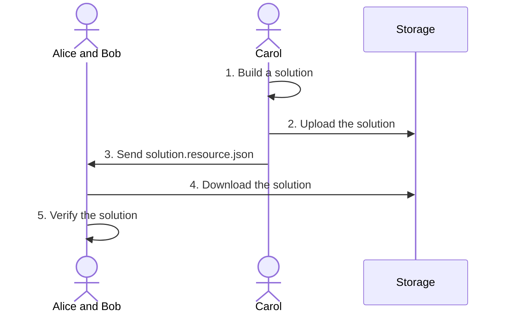
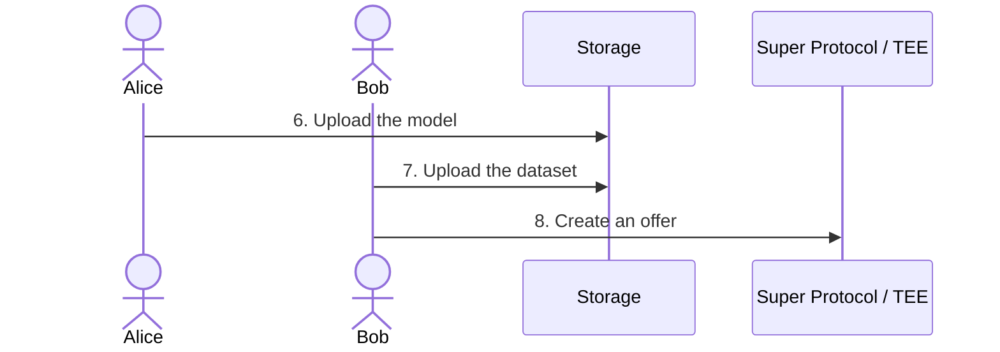
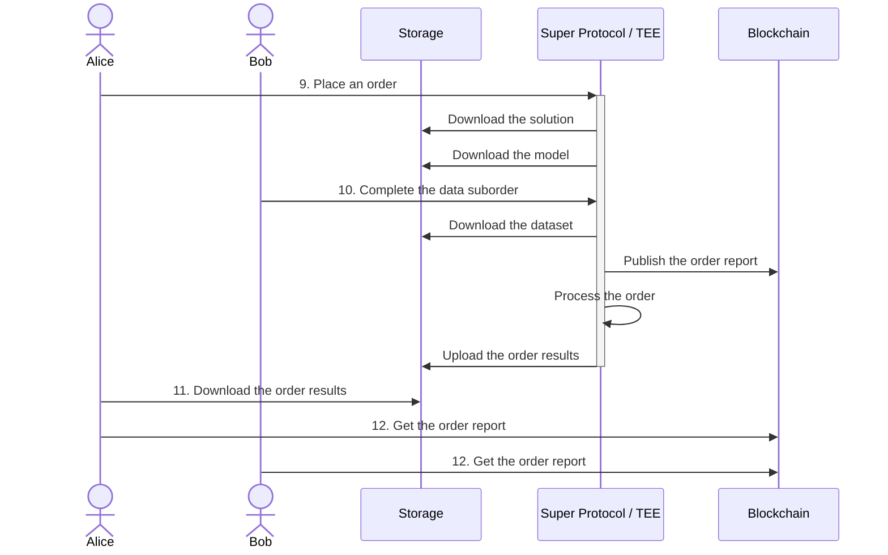

Super Protocol enables independent parties to jointly compute over their private inputs without revealing those inputs to one another.

This guide describes an example of confidential collaboration on Super Protocol: a fine-tuning of a pre-trained AI model. The scenario involves three parties:

- **Alice** owns the AI model.
- **Bob** owns the dataset.
- **Carol** provides the training engine and scripts.

Neither Alice nor Bob is willing to share their intellectual property with other parties. At the same time, Carol must share her training engine and scripts with both parties so they can verify the code is safe to run on their data.

If Carol's training engine or scripts are proprietary and she cannot share them, a possible alternative is to involve independent security experts who can audit the code without exposing it publicly. In this case, the workflow will differ slightly: because Carol cannot share the files with Alice, she must create an offer on Super Protocol Marketplace (similar to Bob's [Step 8](/cli/guides/fine-tune#bob-8-create-an-offer)).

The computation runs on Super Protocol within a <a id="tee"><span className="dashed-underline">Trusted Execution Environment</span></a> that is isolated from all external access, including by Alice, Bob, Carol, the hardware owner, and the Super Protocol team. Additionally, Super Protocol's Certification System provides verifiability, eliminating the need for trust.

The following guide describes just one example. Super Protocol's architecture enables a range of confidential collaboration scenarios.

## General workflow

### Prepare solution


<br/>

Carol builds a <a id="solution"><span className="dashed-underline">solution</span></a>—a Docker image containing her training engine and  script (1). She uploads the solution using SPCTL (2) and grants Alice and Bob (or independent security experts) access for verification (3).

Alice and Bob download the solution (4) and verify it is safe to process their data (5).

### Upload the content


<br/>

Alice uploads her model (6) and Bob uploads his dataset (7) to remote storage using SPCTL. The dataset is automatically encrypted during upload, and only Bob holds the key.

Bob creates an <a id="offer"><span className="dashed-underline">offer</span></a> on the Marketplace (8). The offer require Bob's manual approval for use. He shares the offer's IDs with Alice.

### Execute


<br/>

Alice places an <a id="order"><span className="dashed-underline">order</span></a> on Super Protocol adding the solution, her model, and Bob's offer. The order does not proceed automatically and remains **Blocked** by the data suborder with Bob's dataset.

Bob manually completes the respective data suborder. The command he uses includes the solution hash. The completion will be successful only if this hash matches the actual solution hash.

If the suborder is completed successfully, the execution of the main order proceeds.

When the main order is complete, Alice downloads the result.

## Prerequisites

### Alice

- [SPCTL](/cli)

### Bob

- [SPCTL](/cli)
- Provider Tools

### Carol

- [SPCTL](/cli)
- Docker

## Prepare a solution

### Carol: 1. Build a solution

1.1. Write a Dockerfile that creates an image with the training engine.

Keep in mind the special file structure inside the <a id="tee"><span className="dashed-underline">TEE</span></a>:

| **Location**                                                      | **Purpose**                           | **Access** |
| :-                                                                | :-                                    | :- |
| `/sp/inputs/input-0001`<br/>`/sp/inputs/input-0002`<br/>etc.      | Possible data locations               | Read-only |
| `/sp/output`                                                      | Output directory for results          | Write; read own files |
| `/sp/certs`                                                       | Contains the order certificate        | Read-only |

Your solution must find the data in `/sp/inputs` and write the results to `/sp/output`.

You may either include the training scripts in the image or upload them separately using SPCTL and then attach the uploaded scripts to the order as `--data` at [Step 9](/cli/guides/fine-tune#alice-9-place-an-order).

:::important

Always use absolute paths, such as `/sp/...`.

:::

You can find several Dockerfile examples in the [Super-Protocol/solutions](https://github.com/Super-Protocol/solutions) GitHub repository, particularly in the Unsloth directory.

1.2. Build an image:

```shell
docker build -t <SOLUTION> .
```

Replace `<SOLUTION>` with the name of your solution.

1.3. Save and archive the image:

```shell
docker save <SOLUTION>:latest | gzip > <SOLUTION>.tar.gz
```

### Carol: 2. Upload the solution

```shell
./spctl files upload <SOLUTION>.tar.gz \
  --output solution.resource.json \
  --filename <SOLUTION>.tar.gz \
  --use-addon
```

If you did not include training scripts in the image, upload them separately in a similar manner:

```shell
./spctl files upload <SCRIPTS_DIR> \
  --output scripts.resource.json \
  --use-addon
```

Replace `<SCRIPTS_DIR>` with the path to the directory containing your training scripts.

### Carol: 3. Send the solution to Alice and Bob

Send Alice and Bob (or independent auditors) the output resource files from the previous step.

### Alice and Bob: 4. Download the solution

```shell
./spctl files download solution.resource.json . --use-addon
```

### Alice and Bob: 5. Verify the solution

Review the image to ensure it is safe to process your data.

### Alice: 6. Upload the model

```shell
./spctl files upload <MODEL_DIR> \
  --output model.resource.json \
  --use-addon
```

Replace `<DATASET_DIR>` with the path to the dataset directory.

:::warning

Although the uploaded content is encrypted, the output resource file contains information on how to access and decrypt it.

Do not share resource files if the uploaded content is sensitive!

:::

### Bob: 7. Upload the dataset

```shell
./spctl files upload <DATASET_DIR> \
  --output dataset.resource.json \
  --use-addon
```

Replace `<DATASET_DIR>` with the path to the dataset directory.

### Bob: 8. Create an offer

8.1. In the Provider Tools directory, create a file named `offer-info.json`. Paste the following:

```json title="offer-info.json"
{
   "name":"Offer name",
   "group":"0",
   "offerType":"3",
   "cancelable":false,
   "description":"Offer description",
   "restrictions":{
      "offers":[         
      ],
      "types":[         
      ]
   },
   "input":"",
   "output":"",
   "allowedArgs":"",
   "allowedAccounts":[      
   ],
   "argsPublicKey":"",
   "resultResource":"",
   "subType":"0",
   "version":{
      "version":1,
      "status":"0",
      "info":{
         "metadata":{
            "groupingOffers":true
         }
      }
   }
}
```

Modify the offer name and description; leave the rest intact. Save and close the file.

8.2. In the same directory, create a file named `slot-info.json`. Paste the following:

```json title="slot-info.json"
{
    "info": { "cpuCores": 0, "gpuCores": 0, "diskUsage": 10485760, "ram": 0, "vram": 0 },
    "usage": {
      "maxTimeMinutes": 0,
      "minTimeMinutes": 15000,
      "price": "0",
      "priceType": "1"
    },
    "option": { "bandwidth": 0, "externalPort": 0, "traffic": 0 }
}
```

Adjust the value set to `diskUsage` so that it is larger than the size of your dataset in bytes. Save and close the file.

8.3. Register an offer:

```shell
./provider-tools register data --result <DATASET_JSON>
```

Replace `<DATASET_JSON>` with the path to the `dataset.resource.json` file.

:::note

If you are registering an offer for the first time, you will be prompted to complete the provider setup. Enter a provider name and then a brief description. Save the provider information to a file when prompted.

:::

Follow the dialog:

Q: `Have you already created a DATA offer?`<br/>
A: `n` (No)

Q: `Please specify a path to the offer info json file`<br/>
A: `./offer-info.json`

Q: `Please specify a path to the slot info json file`<br/>
A: `./slot-info.json`

Q: `Do you want to add another slot?`<br/>
A: `n` (No)

Wait for the offer to be created and find a line in the output with the IDs of the offer and slot, for example:

```text
Slot 119654 for offer 18291 has been created successfully
```

Provide Bob with these IDs. Ignore other instructions you see in the output.

## Execution

### Alice: 9. Place an order

9.1. Place an order with the solution, your model, and Bob's data offer. If the training scripts were uploaded separately, add them as data:

```shell
./spctl workflows create \
   --solution ./solution.resource.json \
   --data ./model.resource.json \
   --data <OFFER_ID>,<SLOT_ID> \
   --tee <COMPUTE>
   [--data ./scripts.resource.json]
```

Replace:

- `<OFFER_ID>` with the offer ID provided by Bob
- `<SLOT_ID>` with the slot ID provided by Bob
- `<COMPUTE>` with the desired compute offer ID.

Find the order ID in the output, for example:

```shell
Workflow was created, TEE order id: ["260402"]
```

9.2. Get the suborder ID:

```shell
./spctl orders get <ORDER_ID> --suborders --suborders_fields id,type,status
```

Replace `<ORDER_ID>` with the order ID.

Provide Bob with the order ID and the `Data` suborder ID.

### Bob: 10. Complete the data suborder

Manually complete the data suborder:

```shell
./spctl orders complete <SUBORDER_ID> \
   --result ./dataset.resource.json \
   --status done \
   --solution-hash <SOLUTION_HASH>
```

Replace:

- `<SUBORDER_ID>` with the data suborder ID
- `<SOLUTION_HASH>` with the hash from the `solution.resource.json` file. If the solution was modified, its hash will not match the hash you enter. In this case, the suborder will not be completed, and the order will not proceed.

### Alice: 11. Download the order results

11.1. Check the order status:

```shell
./spctl orders get <ORDER_ID>
```

Replace `<ORDER_ID>` with the order ID.

11.2. When the status is `Done` or `Error`, download the result:

```shell
./spctl orders download-result <ORDER_ID>
```

If the order ended up with an error, the results will contain execution logs that may be useful for troubleshooting.

### Alice and Bob: 12. Get the order report

```shell
./spctl orders get-report <ORDER_ID> --save-to report.json
```

The report contains the full certificate chain, from the Root CA to the order certificate, and workload metadata.

Ensure you see `Order report validation successful!` in the output.

Additionally, find entries in the `runtimeInfo` array that start with `"type": "Image"` and `"type": "Data"`. For example:

```json
{
 "type": "Data",
 "size": 12901,
 "hash": {
 "algo": "sha256",
 "hash": "8598805cd2136a4beff17559a7228854f6a8cc0b027856ea5c196fb8d0602501",
 "encoding": "hex"
 }
},
```

These hashes are of the actual solution and data that were executed within a TEE. Compare them with the solution and dataset hashes from the respective resource files.
