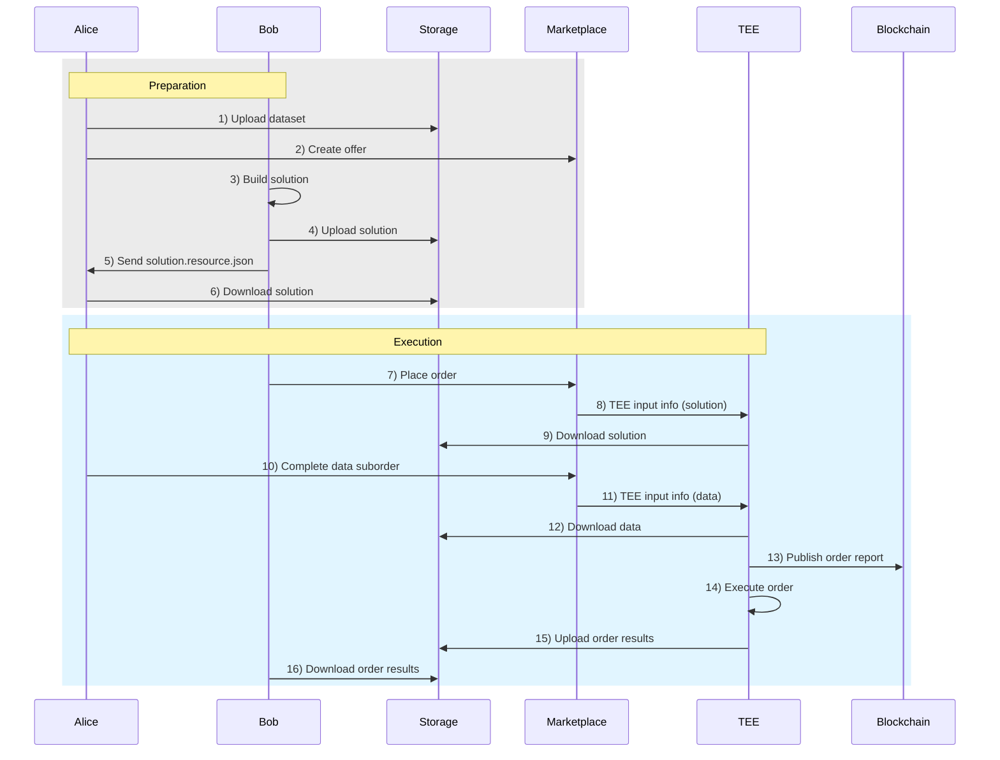

Super Protocol enables multiple independent parties to jointly compute over their private inputs without revealing those inputs to each other.

The following instructions describe a secure fine-tuning of a pre-trained AI model that involves two parties:

- **Alice** owns a private dataset.
- **Bob** owns a pre-trained AI model he wants to fine-tune on Alice's data using a model training engine and scripts.

Neither party is ready to share its intellectual property—the model and dataset—with the other.

The training engine and scripts, however, must be shared with Alice (or third-party security experts) for verification to ensure they are safe to process Alice's data.

The scenario does not require trust between Alice and Bob. The execution occurs within a <a id="tee"><span className="dashed-underline">Trusted Execution Environment</span></a> protected from all outside access by anyone, including Alice, Bob, the computing hardware owner, and the Super Protocol team.

Note that this guide presents just a single example of verifiable collaboration. Super Protocol's flexible nature enables a range of scenarios involving multiple parties.

## General workflow

**Preparation**:

Alice uploads the dataset to a remote storage using SPCTL. It automatically encrypts the dataset during upload, and only Alice has the key.

Alice creates an <a id="offer"><span className="dashed-underline">offer</span></a> on the Marketplace. The offer cannot be used without Alice's manual approval. Alice provides Bob with the offer's IDs.

Bob builds a <a id="solution"><span className="dashed-underline">solution</span></a>—a Docker image with the training engine and scripts. He uploads the solution using SPCTL and provides Alice with access for verification.

**Execution**:

Bob places an <a id="order"><span className="dashed-underline">order</span></a> on Super Protocol using his solution and Alice's offer. The order does not proceed automatically and remains **Blocked** by the data suborder.

Alice manually completes the data suborder. The command includes the solution hash provided by Bob; the completion will be successful only if the hash in the command matches the actual solution hash. This lets the main order proceed.

When the order is complete, Bob downloads the result.



Actors: *Alice*, *Bob*
Places: *Storage*, *Marketplace*, *TEE*, *Blockchain*

**Preparation**:

1. *Alice* interacts with *Storage*: Upload a dataset.
2. *Alice* interacts with *Marketplace*: Create an offer.
3. *Bob* interacts with himself: Build a solution.
4. *Bob* interacts with *Storage*: Upload the solution.
5. *Bob* interacts with *Alice*: Give Alice solution.resource.json.
6. *Alice* interacts with *Storage*: Download the solution.

**Execution**:

7. *Bob* interacts with *Marketplace*: Place an order.
8. *Marketplace* interacts with *TEE*: Pass the TEE Input Info (solution).
9. *TEE* interacts with *Storage*: Download the solution.
10. *Alice* interacts with *Marketplace*: Complete the Data suborder.
11. *Marketplace* interacts with *TEE*: Pass the TEE Input Info (data).
12. *TEE* interacts with *Storage*: Download the data.
13. *TEE* interacts with *Blockchain*: Publish the order report.
14. *TEE* interacts with itself: Execute the order.
15. *TEE* interacts with *Storage*: Upload the order results.
16. *Bob* interacts with *Storage*: Download the order results.

## Prerequisites

### Alice

- [SPCTL](/cli)
- Provider Tools

### Bob

- [SPCTL](/cli)
- Docker

## Preparation

### Alice

1. Upload the dataset:

```shell
./spctl files upload <DATASET_DIR> \
  --output dataset.resource.json \
  --use-addon
```

Replace `<DATASET_DIR>` with the path to the dataset directory.

:::important

The uploaded content is encrypted. However, the output `dataset.resource.json` file contains information on how to access and decrypt it.
Do not share resource files if the uploaded content is sensitive!

:::

2. In the Provider Tools directory, create a file named `offer-info.json`. Paste the following:

```json title="offer-info.json"
{
   "name":"Offer name",
   "group":"0",
   "offerType":"3",
   "cancelable":false,
   "description":"Offer description",
   "restrictions":{
      "offers":[         
      ],
      "types":[         
      ]
   },
   "input":"",
   "output":"",
   "allowedArgs":"",
   "allowedAccounts":[      
   ],
   "argsPublicKey":"",
   "resultResource":"",
   "subType":"0",
   "version":{
      "version":1,
      "status":"0",
      "info":{
         "metadata":{
            "groupingOffers":true
         }
      }
   }
}
```

Modify the offer name and description; leave the rest intact. Save and close the file.

3. In the same directory, create a file named `slot-info.json`. Paste the following:

```json title="slot-info.json"
{
    "info": { "cpuCores": 0, "gpuCores": 0, "diskUsage": 10485760, "ram": 0, "vram": 0 },
    "usage": {
      "maxTimeMinutes": 0,
      "minTimeMinutes": 15000,
      "price": "0",
      "priceType": "1"
    },
    "option": { "bandwidth": 0, "externalPort": 0, "traffic": 0 }
}
```

Adjust the value set to `diskUsage` so that it is larger than the size of your dataset in bytes. Save and close the file.

4. Register an offer:

```shell
./provider-tools register data --result <DATASET_JSON>
```

Replace `<DATASET_JSON>` with the path to the `dataset.resource.json` file.

:::note

If you are registering an offer for the first time, you will be prompted to complete the provider setup. Enter a provider name and then a brief description. Save the provider information to a file when prompted.

:::

Follow the dialog:

Q: `Have you already created a DATA offer?`
A: `n` (No)

Q: `Please specify a path to the offer info json file`
A: `./offer-info.json`

Q: `Please specify a path to the slot info json file`
A: `./slot-info.json`

Q: `Do you want to add another slot?`
A: `n` (No)

Wait for the offer to be created and find a line in the output with the IDs of the offer and slot, for example:

```
Slot 119654 for offer 18291 has been created successfully
```

Provide Bob with these IDs. Ignore other instructions you see in the output.

### Bob

1. Prepare the solution: write a Dockerfile that creates an image with your training engine and scripts. Keep in mind the special file structure inside the <a id="tee"><span className="dashed-underline">TEE</span></a>:

| **Location**                                                      | **Purpose**                           | **Access** |
| :-                                                                | :-                                    | :- |
| `/sp/inputs/input-0001`<br/>`/sp/inputs/input-0002`<br/>etc.      | Possible data locations               | Read-only |
| `/sp/output`                                                      | Output directory for results          | Write; read own files |
| `/sp/certs`                                                       | Contains the order certificate        | Read-only |

Your solution must find the data in `/sp/inputs` and write the results to `/sp/output`.

:::important

Always use absolute paths, such as `/sp/...`.

:::

You can find several Dockerfile examples in the [Super-Protocol/solutions](https://github.com/Super-Protocol/solutions) GitHub repository.

2. Build an image:

```shell
docker build -t <SOLUTION> .
```

Replace `<SOLUTION>` with the name of your solution.

3. Save and archive the image:

```shell
docker save <SOLUTION>:latest | gzip > <SOLUTION>.tar.gz
```

Replace `<SOLUTION>` with the name of your solution.

4. Upload the archive:

```shell
./spctl files upload <SOLUTION>.tar.gz \
  --output solution.resource.json \
  --filename <SOLUTION>.tar.gz \
  --use-addon
```

Send Alice the output `solution.resource.json` file.

### Alice

Download the image:

```shell
./spctl files download solution.resource.json . --use-addon
```

Review the image to ensure it is safe to process your data.

## Execution

### Bob

1. Place an order:

```shell
./spctl workflows create \
   --solution ./mrs-solution.json \
   --data <OFFER_ID>,<SLOT_ID> \
   --tee <COMPUTE>
```

Replace:

- `<OFFER_ID>` with the offer ID provided by Alice
- `<SLOT_ID>` with the slot ID provided by Alice
- `<COMPUTE>` with the desired compute offer ID.

Find the order ID in the output, for example:

```shell
Workflow was created, TEE order id: ["260402"]
```

2. Get the suborder ID:

```shell
./spctl orders get <ORDER_ID> --suborders --suborders_fields id,type,status
```

Replace `<ORDER_ID>` with the order ID.

Provide Alice with the order ID and the `Data` suborder ID.

### Alice

Manually complete the Data suborder:

```shell
./spctl orders complete <SUBORDER_ID> \
   --result ./dataset.resource.json \
   --status done \
   --solution-hash <SOLUTION_HASH>
```

Replace:

- `<SUBORDER_ID>` with the Data suborder ID
- `<SOLUTION_HASH>` with the hash from the `solution.resource.json` file. If the hash you enter does not match the actual hash of the solution used in the order, it means the order uses another (or modified) solution compared to the one you reviewed. In this case, the suborder will not be completed, and the order will not proceed.

### Bob

1. Check the order status:

```shell
./spctl orders get <ORDER_ID>
```

Replace `<ORDER_ID>` with the order ID.

2. When the status is `Done` or `Error`, download the result:

```shell
./spctl orders download-result <ORDER_ID>
```

If the order ended up with an error, the results will contain execution logs that may be useful for troubleshooting.

### Alice and Bob

Get the order report:

```shell
./spctl orders get-report <ORDER_ID> --save-to report.json
```

Additionally, find entries in the `runtimeInfo` array that start with `"type": "Image"` and `"type": "Data"`. For example:

```json
{
 "type": "Data",
 "size": 12901,
 "hash": {
 "algo": "sha256",
 "hash": "8598805cd2136a4beff17559a7228854f6a8cc0b027856ea5c196fb8d0602501",
 "encoding": "hex"
 }
},
```

These are hashes of the actual solution and data that were executed within a TEE. Compare them with the solution and dataset hashes from the respective resource files.
