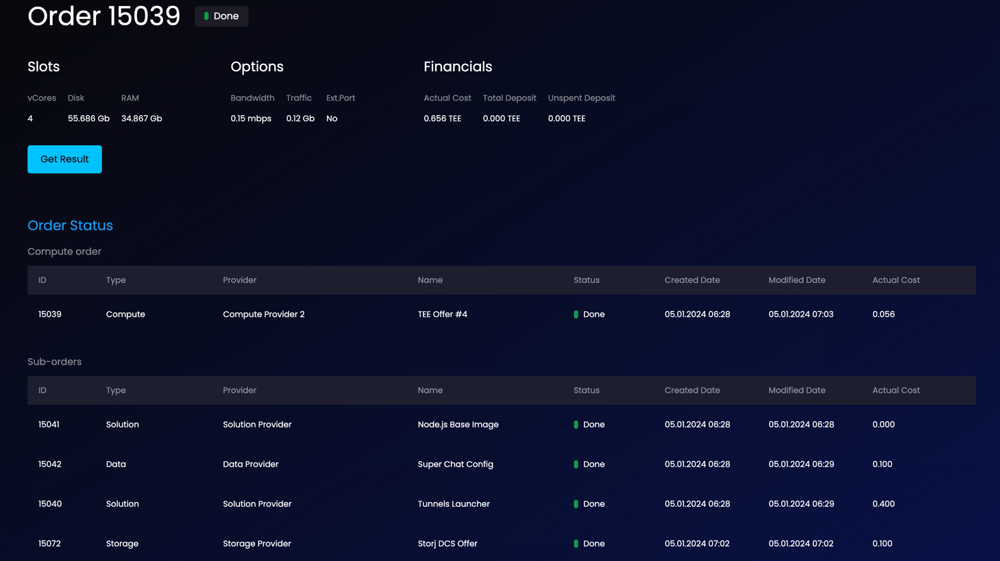

This is probably the most important command in Super Protocol. It manages the creation of new orders.

It's best to read up on the fundamental Super Protocol concepts - [offers](/developers/fundamentals/offers), [orders](/developers/fundamentals/orders), [requirements and configurations](/developers/fundamentals/slots) - in advance. The [Marketplace GUI Walkthrough](/developers/marketplace/walkthrough) is also helpful in understanding the logic of order creation.

This command creates the main order (TEE compute) as well as sub-orders (solution, data, storage) that are related to the main order. For solutions and data you can choose offers from the Marketplace or upload your own.

The result of this command might look like this (in Marketplace GUI):



## Usage

```
./spctl workflows create [OPTIONS]
```

## Example: Marketplace Offers

Let's say you want to deploy [Super Chat](/developers/offers/superchat) using only the offers from the Marketplace, following the steps in the [Marketplace GUI Walkthrough](/developers/marketplace/walkthrough).

The command you'd use would look something like this:

```
./spctl workflows create --solution 11,11 --solution 6,2 --data 15,19 --storage 23,27
```

Let's break this down:
* `--solution 11,11` - the [Tunnels Launcher](/developers/offers/launcher), offer ID 11. Requirements:  slot ID also 11.
* `--solution 6,2` - the Node.js back image, offer ID #6. Requirements: slot ID #2.
* `--data 15,19` - Super Chat Config data, offer ID #15. Requirements: slot ID #19.
* `--storage 23,27` - storage for storing results, offer ID #23. Requirements: slot ID #27.

Note the absence of the `--tee` option: it means that auto-select will choose the most appropriate compute offer and configuration for your workload.

In some scenarios you might want to specify the exact compute offer that you want, but leave the rest to the auto-select. Then the command might look like this:

```
./spctl workflows create --tee 4 --solution 11,11 --solution 6,2 --data 15,19 --storage 23,27
```

Where:
* `--tee 4` means that you want to use specifically compute offer #4, but the combinations of slots and offers are to be determined automatically.

## Example: Manual Compute Selection

Let's say you don't want to use auto-select at all, but rather you'd specify exactly which compute offer and configuration you want. Then your command might look something like this:

```
./spctl workflows create --tee 4,7 --tee-slot-count 4 --tee-options 10 --tee-options-count 7 --solution 11,11 --solution 6,2 --data 15,19 --storage 23,27
```
Where:
* `--tee 4,7 --tee-slot-count 4` - compute offer ID #4 with slot ID #7 that is used in 4 increments (so, four times).
* `--tee-options 10 --tee-options-count 7` - compute offer ID #4 (as above) with options ID #10 that is used in 7 increments.

Let's add a bit more complexity and control:

```
./spctl workflows create --tee 4,7 --tee-slot-count 4 --tee-options 10 --tee-options-count 7 --solution 11,11 --solution 6,2 --data 15,19 --storage 23,27 --deposit 2 --min-rent-minutes 120
```

Where:
* `--deposit 2` - deposit is specified as 2 TEE. 
* `--min-rent-minutes 120` - the lease time is specified as 120 minutes. 

If these are not specified, then the default minimums will be used. For instance, for the above offers the minimum deposit is 1.120 TEE and minimum lease time is 60 minutes. Minimum lease is determined by the maximum value of all Min.Time values across all offers in the order: if your compute Min.Time is 40 minutes, your base image Min.Time is 0 minutes, and your Tunnels Launcher Min.Time is 60 minutes, the system will require 60 minutes. 

## Example: Using own solution and data

The examples above use only offers from the Marketplace, but you most likely will want to deploy your own solutions and data. 

Let's take a scenario where you want to deploy your own Python solution with two datasets:

```
./spctl workflows create --solution 5,1  --solution solution.json --data input-1.json --data input-2.json --storage 23,27
```

Where:

* `--solution 5,1` - Python base image with offer ID #5. Requirements: slot ID #1.
* `--solution solution.json` - your own solution (you have to have previously uploaded it to storage using the [upload](/developers/cli_commands/files/upload) command).
* `--data input-2.json` and `--data input-2.json` - your two data sets (also must have been uploaded).

You can learn more about deploying your own solutions in the deployment guides. Probably best to start with the simple Python solutions [here](/developers/deployment_guides/python).

## Options

|**Name, shorthand**|**Description**|
| :- | :- |
|`--tee <id,slotId>`|TEE offer `id` with the `slotId` (required)|
|`--tee-slot-count <count>`|Number of using TEE slots (required)|
|`--tee-options <id...>`|TEE options `id` (TEE options array. Accepts multiple values) (default: [])|
|`--tee-options-count <value...>`|TEE options count array `values`. Accepts multiple values (default: [])|
|`--storage <id,slotId>`|Storage offer `id` (required)|
|`--solution {<id,slotId> OR <path>}`|Solution offer `id` with `slotId` or resource/tii file `path` (required and accepts multiple values)|
|`--data {<id,slotId> OR <path>}`|Data offer `id` with `slotId` or resource/tii file `path` (accepts multiple values)|
|`--deposit <amount>`|`Amount` of the payment deposit in TEE tokens (if not specified, the minimum deposit required is used)|
|`--min-rent-minutes <number>`|Minutes of TEE processing that will be paid in advance|
|`--config <path>`|`Path` to the configuration file. Defaoul value `./config.json`|

