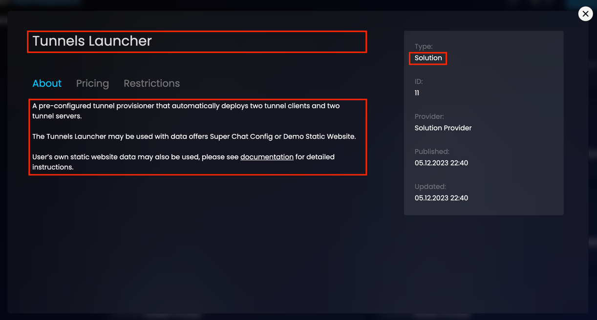
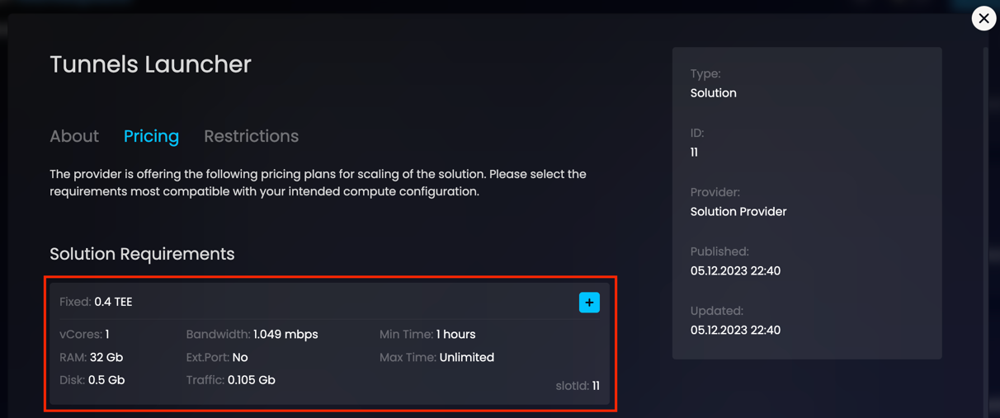

# How to Deploy Data/Solution offer

## **About**
This guide will take you step by step through the process of creating your Data / Solution provider and deploying your own Data / Solution offer to Super Protocol.

moderation

## **Prerequisites**

### Testnet credentials

You should have:
received the credentials by email from Super Team:
- Testnet account address
- Private key
- Access token 

### Set up Provider Tools

Super Protocol has a tool called `provider-tools` through which you can create a provider, create an offer and obtain further instructions how to run the offer.

To start working with the tool, open Terminal in the directory where you want to place the tool for Linux and run the following command:

```
curl -L TBD
chmod +x ./provider-tools
```

## **Step 1 - Setting up accounts**

### Types of accounts

Testnet account is considered as your user account in SuperProcotol under which you will perform actions as a User. Please do not to use it for other purposes.

In Superprotocol, there are three types of provider accounts and each of them performs its own functions:
1. **Authority account** is considered as your main provider account in SuperProcotol under which a provider is created and modified.
2. **Action account** executes actions on behalf of an authority account in Execution Controller with the purpose to add and modify offers. Execution Controller allows processing and further distribution of requests from the blockchain.
3. **Token receiver** account gets rewards as a result of service delivery.
   **Note:** its private key should be stored safely.

We highly recommend that you create and use three different Polygon Testnet accounts. Later on, you will be able to change action and token receiver accounts using SPCTL `providers update` command but please remember that **only one** provider can be created under an authority account.

---

### Creating accounts

Now we will use the Provider Tools to auto-generate three accounts.

Go to the directory where you downloaded Provider Tools and run this command: 

```
./provider-tools setup
```

The tool will ask you questions regarding creation of the provider accounts:

`Do you need to generate a new Authority account?`<br/>
Select `Yes`.

`Do you need to generate a new Action account?`<br/>
Select `Yes`.

`Do you need to generate a new TokenReceiver account?`<br/>
Select `Yes`.

**Note:** alternatively, you can use your own previously created Polygon accounts. You can create them through Metamask and then follow [this guide](https://docs.polygon.technology/tools/wallets/metamask/add-polygon-network/) to add the Polygon Mumbai Testnet network. Select `No` in the menu when prompted and enter their private keys.

---

**Expected step result:**
* `config.json` is created in the Provider Tools directory. It contains the SPCTL configuration for the next step as well as the private keys to your provider accounts.
* Required security deposit of 5 TEE is added to the Action account automatically (for testnet purposes).
* 5 MATICs are added to the Action account automatically (for testnet purposes).

## **Step 2 - Preparing content**

### Prepare offer content

Please follow the [guide](/developers/cli_guides/quick_guide/) to get more details about how to upload them to the storage. The resource file which is generated as a result of uploading will be needed later in this guide.

---


### Upload offer content

<Highlight color="red">Загрузка</Highlight>

<Highlight color="red">генерирует resource json</Highlight>


## **Step 3 - Configuring offer**

Now that we have the accounts, it's time to configure the offers.

You will need to create two .json files.

### Offer description

First, a .json with the general description and properties of the offer.

Copy and save this format in a .json file. You can name it anything you want, but for this tutorial let's call it `offer.json`.

```json title="offer.json"
{
  "name": "Name of your offer goes here",
  "group": "0", // belongs to input group
  "offerType": "2", // belongs to solution type
  "cancelable": false,
  "description": "Description of your offer goes here, it may include HTML",
  "restrictions": {
    "offers": [
    ],
    "types": [
    ]
  },
  "metadata": "",
  "input": "",
  "output": "",
  "allowedArgs": "",
  "allowedAccounts": [],
  "argsPublicKey": "",
  "resultResource": "",
  "linkage": "",
  "hash": ""
}
```

Where you need to fill out the following fields:

* `name` - the name of your offer;
* `offerType` - type has to be either 2 for a Solution offer or 3 for Data offer;
* `description` - the description of your offer. Description may contain HTML.

As an example, this is what these fields look like in the Marketplace:



And in SPCTL (on blockchain), using the [offers get](/developers/cli_commands/offers/offers/get) command:

```
./spctl offers get value 11
```


<br/>
<br/>

You can learn more about the other fields in the [offers update](/developers/cli_commands/offers/offers/update) command.

<Highlight color="red">как правильно писать описания</Highlight>

---

### Offer requirements

Second, a .json with the values of the required slots and options for your solution or data offer.

You can learn more about the slots and options [here](/developers/fundamentals/slots).

In a few words: each offer, either solution or data, has system requirements for execution. This is where you specify these requirements. Each requirements slot can have its own price, either Fixed or Per Hour. Depending on these requirements, the customer will select a TEE compute offer configuration, which cannot be lower than your requirements. 

Copy and save this format in a .json file. You can name it anything you want, but for this tutorial let's call it `offer-slots.json`.

Do this for each requirements slot that you want to add to the offer (you can have multiple).

```json title="offer-slots.json"
{
  "info": {
    "cpuCores": 1.15,
    "gpuCores": 0,
    "diskUsage": 1073741824,
    "ram": 1073741824
  },
  "usage": {
    "maxTimeMinutes": 0,
    "minTimeMinutes": 0,
    "price": "1000000000000000000",
    "priceType": "1" 
  },
  "option": {
    "bandwidth": 1000000,
    "traffic": 1000000000,
    "externalPort": 0
  }
}
```

Modify these fields as necessary. This is your offer, and only you know what compute configuration your solution or data will need to run.

You can learn more about these fields in the [offers add-slot](/developers/cli_commands/offers/slots/add-slot) command.

As an example, this is what they look like in the Marketplace: 



And in SPCTL (on blockchain), using the [offers get-slot](/developers/cli_commands/offers/slots/get-slot) command:

```
./spctl offers get-slot value --offer 11 --slot 11
```


---

**Expected step result:**
* `solution-offer.json` with offer description is prepared;
* `solution-offer-slots.json` with offer requirements (slots and options) is prepared. There may be more than one.

## **Step 4 - Creating provider and offer**

Let's recap. At this point you need to have the following:

* A folder with Provider Tools. In that folder:
  * `config.json` with the credentials for authority, action and tokenReceiver accounts;
  * `offer-resource.json` which was generated after uploading solution to storage;
  * `offer.json` containing the description of the offer;
  * `offer-slots.json` containing the required slots for the offer;

### Create provider and offer

Now let's put all of this together. 

Run this command:

```
./provider-tools register <offerType> --result ./offer-resource.json
```

Where:
* `<offerType>` is either `data` or `solution`;
* `offer-resource.json` is the resource file that was generated by uploading to storage.

The tool will take you through the following steps:

**First**, the command will automatically download SPCTL into the `tool` directory inside the Provider Tools directory.

**Second**, the Provider Tools will check whether a provider with the Authority account specified in the `config.json` is already registered on blockchain. 
* If provider exists, the prompt will go to the next step; 
* If provider doesn't exist, then you will be prompted to create one. You will need to specify its name and description. The system will also prompt you to save the provider info into a .json in case you need to update the provider description later.

**Third**, the Provider Tools will ask if there are solution or data offers already created on blockchain.
* 
* If you already created an offer and want to update it, select `Yes`. The tool will prompt you to specify the offer ID and the offer private key. It can be found in the `config.json`, in `providerDataOffers` section, in `argPrivatekey` field.


It will be available in `config.jso`n file, in providerDataOffers section, in `argPrivatekey` field. The public key will be written to `argPublickey` field in the offer.

While running the command, the tool will :
1. download SPCTL in the directory `tool`
2. check whether a provider exists based on accounts in config.json file
- if no, a new provider will be created, you will be asked to specify its name and description
3. suggest saving your provider information into a json file
4. ask if there is a data / solution offer already created:
- if yes, you will be asked to specify its id and private key
    - you will be offered to add new slots as well
- if no, you will be asked to specify the paths to json files from Step 2, which will be used to create an offer and its slots.


check that provider and offer were created


**Important notes:**
1. We strongly insist on creating a new offer using this tool because you will be able to access an offer’s private key that is required for deployment. The private key is generated on the first step when you provide the path to your offer information. 
2. If any issue occurs while creating an offer or its slot, you can always check the error details in `error.log` file located in `tool` directory and take corresponding action.

As a result, a new directory `<offerType>-execution-controller` will be created in the root directory. It will contain all the necessary artifacts to run your Execution Controller.

### Security deposit

Before executing the next command, you should check the balance of action account.

The operation of creating an offer costs 5 TEEs and it will be debited form action account. So, there should be enough TEEs (for a creation operation in SuperProtocol) and MATICs (for a write operation to blockchain). **Note:** you can receive tokens in the [Marketplace](/developers/marketplace/first-steps/#4-receiving-tokens).


## **Step 5 - Running Execution Controller**
In the terminal, you will observe an instruction how to run your Execution Controller. Please use the option of running via shell script.

To be able to run your Execution Controller, you will need to:
1. install [jq](https://jqlang.github.io/jq/download/);
2. open the terminal and go to your `<offerType>-execution-controller` directory;
3. run the script using the following command: `bash runner.sh`

Every 5 minutes the script will check if there are any orders in the status New or Processing that contain your offer. If there are any, it will complete them using the resource file to access your uploaded data / solution.

**Note:** by default, your offer is set to `Unmoderated` mode in the Marketplace. Please contact SuperTeam to set your offer to `Approved` mode in the Marketplace.

## **Troubleshooting**
### How to update a provider
In case you need to update any information in the provider’s description, please use SPCTL providers update command.

### How to run a new offer
In case you need to create and run a new offer in addition to an existing one, you will need to go through the process of configuring an offer at Step 2 once again.

As a result, `<offerType>-execution-controller` directory will be updated in accordance with changes. To check that, please go to `<offerType>-execution-controller` and open `.env` file. A new offer will be added to the block `PROVIDER_OFFERS_JSON`.

### How to update an offer
In case you need to update any information in the offer description, please use SPCTL  offers update command.

### How to update a slot
In case you need to update any information in the slot description, please use SPCTL  offers update-slot command.