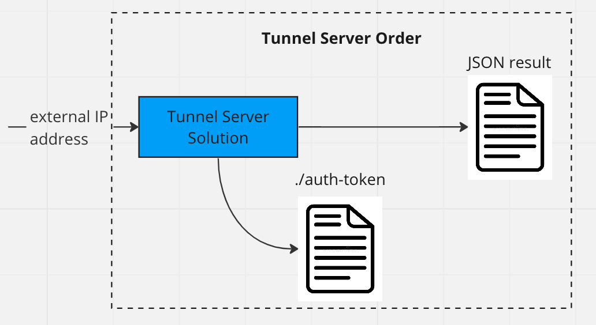

## Механизм туннелирования

Для предоставления внешнего доступа к сервисам, используется механизм туннелирования. В этом процессе два компонента играют ключевую роль: туннель клиент и туннель сервер.

Туннель сервер располагается на узле (ноде) с открытым (белым) IP адресом. Его задача заключается в регистрации соединений от туннель клиентов по IP адресу и перенаправлении (проброске) входящих внешних соединений к зарегистрированным туннель клиентам, которые не имеют открытых IP адресов, и в последующем возврате ответов от этих клиентов.

Один туннель сервер способен обслуживать одновременно несколько доменов и соответствующих им туннель клиентов. При подключении множества туннель клиентов к одному и тому же домену, сервер использует механизм round robin для равномерного распределения запросов между клиентами.

## Создание заказа на туннель сервер

Для выделения IP адреса от туннель сервера, необходимо создать заказ. В данных заказа в корне передается файл ./auth-token, содержащий внутри текстовый токен. Этот токен впоследствии будет использоваться туннельным клиентом для аутентификации.

В ответ на заказ, в результате заказа, туннель сервер возвращает JSON строку следующего формата: `{"ip":"123.123.123.123","port":443}`. Это означает, что туннель сервер успешно присвоил IP адрес и готов к подключению на данном IP и порте для переданного токена.

После получения ответа от туннель сервера, вы можете подключиться к нему с помощью туннельного клиента.