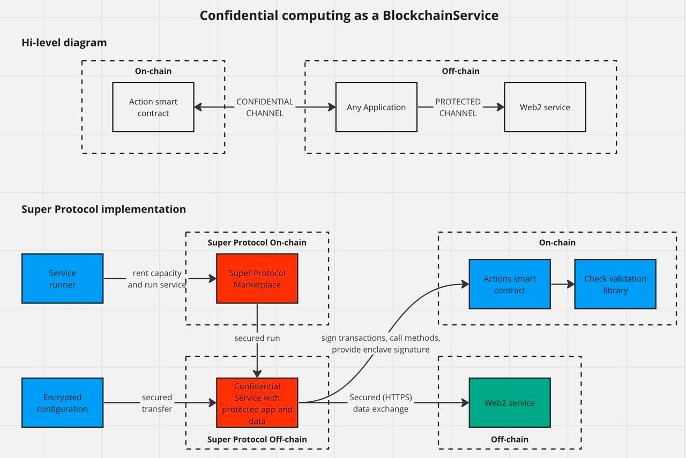

Для того чтобы обеспечить конфиденциальное взаимодействие ончейн и оффчейн компонентов, а также их интеграцию с защищенными web2-сервисами, применяется решение на основе Super Protocol. В этом процессе необходимо запустить конфиденциальный сервис, который будет связываться как с блокейном, так и с web2-сервисами из конфиденциальной среды.

Использование смарт контрактов в ончейн части системы позволяет не только автоматизировать процессы, но и обеспечивать их надежность и безопасность, а также связать результаты выполнения с ончейн процессингом.

Конфиденциальный и защищенный каналы, предназначены для безопасного обмена данными между блокчейн-сетью и внешними приложениями. Это обеспечивается использованием протоколов шифрования, таких как HTTPS, для защиты данных в процессе их передачи и защиты от атаки посредине.

Блокчейн маркетплейс Super Protocol выступает в качестве связующего звена между поставщиками вычислительных мощностей и потребителями услуг, упрощая процесс поиска и аренды необходимых ресурсов.

Таким образом, решение Super Protocol обеспечивает комплексную безопасность и надежность для выполнения конфиденциальных вычислений, и предоставления результатов в блокчейн-среду, учитывая все аспекты от управления ресурсами до интеграции с внешними сервисами.

Для запуска своего решения нужно: 
1. Собрать свое решение, например на базовом образе NodeJs. Можно взять за основу пример с [Оракулом.](/developers/deployment_guides/nodejs_blockchain/oracles)

2. Развернуть смарт контракты, отвечающие за взаимодействие с решением и предоставляющие данные или выполняющие дальнейшие действия.

4. Создать заказ на аренду мощностей в Super Protocol и передать туда зашифрованное решение и данные (если это необходимо). Заказ можно создать как с помощью [CLI](/developers/cli_guides), так и с помощью [Маркетплейса](/developers/marketplace/).

5. Дождаться запуска заказа и получать промежуточные результаты из распределенного хранилища, в котором будут логи выполнения и файлы результата. Если во время выполнения решения произошли какие либо ошибки, они также будут представлены в результатах или логах. Это очень удобно для аудита и отладки кода.