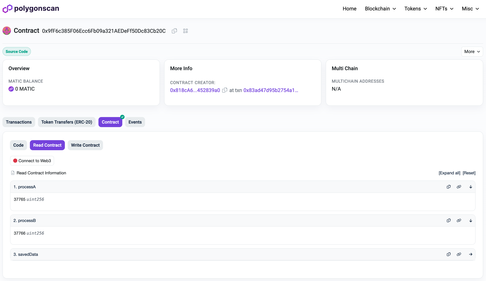
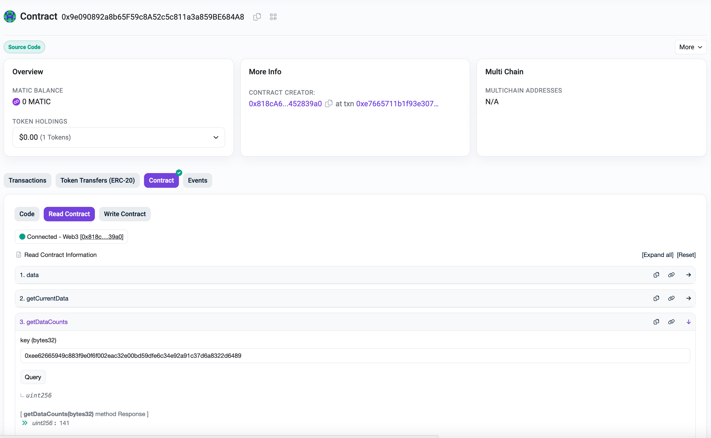

## Confidential Oracles

This example will guide you step by step through the process of deploying your own Oracle service on the Super Protocol. The Oracle's function will be to store reliable historical data on the BTC/USD price. We assume that you are familiar with the purpose of [oracles](https://en.wikipedia.org/wiki/Blockchain_oracle) in web3.

This guide uses free [CoinAPI](https://coinapi.io/) service to access the price data. If you stick with this API, you'll need to register and obtain an api key.

<Highlight color="red">краткое общее описание приложения и возможно ссылка на уже задеплоиное приложение для референса. Возможно ли (и нужно ли) сделать специальный оффер для деплоя оракулов по клику - или там слишком много кастомных настроек?</Highlight>

## **Goal**

The goal of this example is to show process of deploying and operating an oracle with the following criteria:

* The Oracle service should publish the BTC/USD exchange rate every 10 minutes by accessing the open [CoinAPI](https://rest.coinapi.io/v1/exchangerate/BTC/USD).

* The Oracle smart contract must receive and store data from the Oracle script and verify that this script was executed and performed within a Trusted Execution Environment (TEE).

* Our DApp (smart contract) should be able to read this data and ensure that it is: **a)** Up-to-date (by verifying the timestamp) and **b)** Available to be read on-chain.

## Prerequisites

To successfully complete this guide, you will need experience with Node.js, EVM blockchains and Solidity programming. В этой статье вы будете использовать разные инструменты, котороые мы рекомендуем настроить заранее:

- [Polygonscan](https://polygonscan.com/login) - You will need to register and create API Key for contract verification on block explorer. Несмотря на то, что в этом гайде мы будем пользоваться тестовой сетью [Mumbai](https://mumbai.polygonscan.com/), API key нужно взять с обозревателя блоков майннета.

- [Docker](https://www.docker.com/get-started/) - Для сборки решений, которые будут выполняться на Super Protocol.

- [StorJ](/developers/cli_guides/storages) - децентрализованное хранилище данных. Через него будет передаваться зашифрованный конфигурация для скрипта-оракула (кошелек “паблишера” и т.д.)

- [CoinAPI](https://coinapi.io/) - Зарегистрироваться и получить Api ключ - после регистрации он приходит на почту, в личном кабинете ключи не отображаются.

Для вашего удобства, мы предлагаем скачивать и хранить используемые далее инструменты в одной директории. Перейдите в желаемый раздел файловой системы и создайте папку:

```shell
mkdir super-protocol && cd super-protocol 
```

В нее нужно скачать:

- [solutions](https://github.com/Super-Protocol/solutions) - репозиторий с готовыми примерами солюшенов, в том числе Blockchain Oracle

- [spctl](/developers/cli_guides/downloading) - консольный интерфейс Супер Протокола для создания заказа оракула. После скачивания обязательно заполните весь конфиг [по инструкции](https://docs.dev.superprotocol.com/developers/cli_guides/configuring) 

:::note
SMART-CONTRACTS IN THESE EXAMPLES USE UN-AUDITED CODE. DO NOT USE THIS CODE IN PRODUCTION.
:::

:::caution
Мы будем работать с тестовой сетью Mumbai. В дальнейших шагах потребуется установить переменную окружения MUMBAI_URL, указав путь к Mumbai Polygon ноде. Если у вас нет подходящей, мы предоставляем нашу https://mumbai.polygon.superprotocol.com/hesoyam
:::

---

## **Step 1. Deploy the "x509 verifier" smart contract**

This smart contract is responsible for on-chain cryptographic verification of the Oracle service, ensuring that it is genuinely running in a secure SGX Trusted Execution Environment (TEE) with validation of TEE quote, MRENCLAVE and MRSIGNER.

It is worth noting that this smart contract, the `x509 verifier` acts as a validator of data and contains functionality not tied to the implementation of the Oracle itself. In other words, it allows for the creation of multiple instances of Confidential Oracles, all pointing to the same 'x509 verifier.'

### Preparing


Перейдите в директорию в склонированном репозитории `solutions`, содержащую контракт: 

```shell
cd ./solutions/Blockchain/sp-x509/
cp .env.example .env
```

To set up the project, you will need to set env variables in `.env` file:

- `PRIVATE_KEY` - Your wallet private key with MAITC 
- `MUMBAI_URL` - https://mumbai.polygon.superprotocol.com/hesoyam
- `POLYGON_API_KEY` - Your API Key from [Polygonscan](https://polygonscan.com/login)

Then install dependencies and compile the contract:

```shell
npm i
npx hardhat compile
```

We will use Intel's SGX Root CA Certificate [intel-root-cert.pem](https://github.com/Super-Protocol/solutions/blob/main/Blockchain/sp-x509/intel-root-cert.pem) for deployment. Essentially, the integrity of the entire certificate chain depends on this root certificate. When an error arises during the process of verifying traceability and trustworthiness, it means that the data is currently untrusted, and the opposite is true when no errors are found.

### Deploy the smart-contract

In the same directory, execute this command to deploy the verifier contract to the polygon testnet network.

```shell
npx hardhat deploy --cert ./intel-root-cert.pem --network mumbai
```

<Highlight color="red">как адрес этого контракта связан с предыдущей строчкой?</Highlight>

Upon execution, a contract address will be printed to console. It will be used in later steps, so make sure you save it.

To be able to interact with the contract via GUI (e.g. Polygonscan) you will need to verify the contract on-chain by uploading the contract abi.

```shell
npx hardhat verify-x509 --cert ./intel-root-cert.pem --network mumbai --address <verifier-contract-address>
```

Вы должны увидеть сообщение `Successfuly verified`. На этом настройка контракта `x509 verifier` завершена, его можно посмотреть через Polygonscan. Пример уже задеплоенного и верифицированного контракта - [0xb57718CC0A2149A376715503d15182f5a773e1F7](https://mumbai.polygonscan.com/address/0xb57718CC0A2149A376715503d15182f5a773e1F7#readContract)


## **Step 2. Prepare Oracle service for deployment on Super Protocol**


Далее, мы переходим к подготовке и деплою компонентов самого Оракла. Этот этап состоит из 2-х компонентов:

- офчейн сервиса, который будет выполняться в защищенной среде ТЕЕ и по расписанию вызывать функции смартконтракта оракла

- смартконтракта оракла который будет хранить в себе данные о цене BTC/USD. Так же, с помощью контракта `sp-x509`, который мы задеплоили на предыдущем шаге, он будет верифицировать, что вызов идет от доверенного офчейн сервиса в рамках сессии.

В этом разделе речь пойдет про первый компонент, и за ним покроем второй.

### Prerequisites

Change current directory to `sp-oracle` and set up the service sub-project:

```shell
cd ../sp-oracle/script/
npm i
npm run build
```

After that, a folder `run` will be created with artifacts for the future solution.

### Скачать базовый образ Node.js

All the solutions that will be processed on Super Protocol, should be built upon supported platform, which are called Base Images. In our case, we will be utilizing [Node.js](https://nodejs.org/). You can find all the supported images on the Marketplace under `Solutions` section with `Base Image` note.

If you haven't done it before (going through other guides), download Node.js base image from [Offer #6](https://marketplace.superprotocol.com/?offerId=6). Open a new terminal window and from `super-protocol` directory, where you downloaded spctl, execute

```shell
./spctl offers download-content 6
```

it will download file `node16-base-solution-image*` to the current directory, which you then need to load to Docker. Paste this command to terminal and press `Tab` to autocomplete the name of the image:

```shell
docker load --input node16-base-solution-image
```

You will see the output `Loaded image: gsc-node16-base-solution:latest`

### Формируем манифест и шифруем наш оракл-сервис

Next, we will build a Docker image of the service. When the Docker image should run within an Intel SGX enclave, the image has to be built and signed with [Gramine](https://gramine.readthedocs.io/en/latest/gsc-installation.html) (a.k.a graminized). Let's create signing key:

```shell
./spctl solutions generate-key signing-key
```

Then, execute the following command in the root of your project to prepare and pack the solution:

```shell
./spctl solutions prepare --pack-solution oracle-solution.tar.gz --write-default-manifest --base-image-path node16-base-solution-image-v0.3.1.tar.gz $(pwd)/solutions/Blockchain/sp-oracle/script/run/ signing-key
```

note, `$(pwd)` - will add the root path to a run folder, to make it absolute.

After running the command, `oracle-solution.tar.gz` and `metadata.json` files will be generated. And in terminal, you will see logs, make sure to save MRENCLAVE and MRSIGNER. These values **differ** on every `prepare` run, so double check yourself on later steps that you use up-to-date values! should look like the following:

```
MRENCLAVE: d6906986298db89f91941921579e058429bd9ec63c0f97246274b25a4bbfbf0c
MRSIGNER: 36f3bb39d10617852d1eef2f5066d8f9add2c65fb1a026d86398fec405fe725c
```

Finally, we will encrypt and upload the prepared solution to a decentralized cloud storage:

```shell
./spctl files upload oracle-solution.tar.gz --output oracle-solution.json --filename oracle-solution.tar.gz --metadata ./metadata.json
```

`oracle-solution.json` file will be generated. It contains StorJ credentials and encryption private data for the uploaded file. Do not share it with untrusted parties. We will use it later to create workflow on Super Protocol.


## **Step 3. Prepare and deploy Oracle smart contract**

### Prepare

For this step you will need an Ethereum account with MATIC testnet coins on it. This account will be used to send transactions from Oracle service to the smart contract. We highly recommend to use a new account, which will be used by the oracle only, to avoid errors with sending transactions, e.g. nonce calculation.

In terminal, open a directory containing smart-contract `solutions/Blockchain/sp-oracle/smart-contract/`.

```shell
cd ./solutions/Blockchain/sp-oracle/smart-contract/
cp .env.example .env
```

To set up the project, you will need to set env variables in `.env` file:

- `MUMBAI_DEPLOYER_PRIVATE_KEY` - Your wallet private key with testnet MAITC
- `MUMBAI_URL` - https://mumbai.polygon.superprotocol.com/hesoyam

Then install dependencies and compile the contract:

```shell
npm i
npx hardhat compile
```

### Deploy oracle

Now we are ready to deploy an Oracle smart contract:

```shell
npx hardhat deploy-oracle --publishers <publisher-address> --enclave <mrenclave> --signer <mrsigner> --verifier <x509-verifier-address> --network mumbai
```
where 
- `<publisher-address>` - Ethereum wallet address that will be used by Oracle service to send new prices to the contract;
- `<mrenclave>`, `<mrsigner>` - values that you received at the end of [Step 2](#step-2-prepare-oracle-service-for-deployment-on-super-protocol). **Note**, if at some point, you will have to redo Step 2 and prepare solution again, you will have different MRENCLAVE and MRSIGNER and will have to change them in smart contract. Refer to [changing mrenclave and mrsigner](#changing-mrenclave-and-mrsigner) to modify these, without redeploying a new contract;
- `<x509-verifier-address>` - x509 verifier contract address, result of [Step 1](#step-1-deploy-the-x509-verifier-smart-contract).

Deployed contract address will be printed to console. Use it to verify contract on-chain, as we did for x509-verifier:

```shell
npx hardhat verify-oracle --address <oracle-address> --publishers <publisher-address> --enclave <mrenclave> --signer <mrsigner> --verifier <x509-verifier-address> --network mumbai
```

Вы должны увидеть сообщение `Successfully verified`. Пример уже задеплоенного контракта оракла - [0x9e090892a8b65F59c8A52c5c811a3a859BE684A8](https://mumbai.polygonscan.com/address/0x9e090892a8b65F59c8A52c5c811a3a859BE684A8#readContract).

### Deploy dApp

Так как оракл выступает хранилищем данных, и его цель - это предоставление актуальных данных для on-chain мира, то для наглядности мы задеплоим простой контракт в роли такого decentralized application, которое будет использовать данные нашего оракла.

```
npx hardhat deploy-app --oracle <oracle-address> --network mumbai
```

verify dApp contract on-chain:

```
npx hardhat verify-app --address <d-app-address> --oracle <oracle-address> --network mumbai
```

Вы должны увидеть сообщение `Successfully verified`. Можете найти этот контракт в Polygonscan по адресу контракта (вот пример уже задеплоенного контракта [0x9fF6c385F06Ecc6Fb09a321AEDeFf50Dc83Cb20C](https://mumbai.polygonscan.com/address/0x9fF6c385F06Ecc6Fb09a321AEDeFf50Dc83Cb20C#readContract)). В конце этого гайда, мы зайдем на страницу этого контракта в Polygonscan и будем следить за изменениями данных.

## **Step 4. Deploy oracle service**

By now, we have:
- deployed contract x509
- deployed contract Oracle
- prepared Oracle service solution

In this section we'll deploy an oracle service, that will be running on Super Protocol inside SGX enclave. To recap, its function is to update BTC/USD price by interval in Oracle contract, which we've deployed on the previous step.

Open a new Terminal window and go to `solutions/Blockchain/sp-oracle/script/inputs/` folder. We'll need to set up a config for Oracle service in this directory.

First, you'll need to retrieve trusted root certificates to validate the connection to the API service, that your oracle will be requesting to. You can extract root certificate of the particular api that you'll be using, but because certificates, may change unpredictably, we recommend listing full root certificates list from your computer. Staying in directory `inputs`, execute:

### Linux
```shell
cat /etc/ssl/certs/*.pem >> ./ca_certificates.crt
```

### Mac OS
```shell
security export -t certs -f pemseq -k /System/Library/Keychains/SystemRootCertificates.keychain -o ./ca_certificates.crt
```

This command will create file `ca_certificates.crt` inside `inputs/` directory, that will contain system root certificates.

Second, create `input.json` out of example:

```shell
cp input.example.json input.json
```

And fill the data:

* interval - частота запросов к API в секундах. (равно частоте публикации данных)
* dataKey - ключ по которому в смарт-контракте будут храниться исторические данные запросов, например “BTC/USD”.
* smartContractAddress - адрес контракта оракула
* publisher - адрес и приватный ключ кошелька, который из анклава будет постить данные в блокчейн
* apiConfig - содержит в себе:
    - endpoint - API url, уже подставлен нужный coinapi
    - auth - содержит в себе ключ для аутентификации, как требует [coinapi](https://docs.coinapi.io/authentication#x-coinapi-key-header). Если вы используете другой API, который не требует аутентификации, оставьте значения пустыии
* debugMode - false

You will end up having two files in `inputs` folder:
- `input.json` file (file must have that name)
- `ca_certificaes.crt`

Create an archive with those files:

```shell
tar -czvf oracle-input.tar.gz input.json ca_certificaes.crt
```

Open a new terminal and go to `super-protocol` folder with spctl. And upload the archive to StorJ:

```shell
./spctl files upload ./solutions/Blockchain/sp-oracle/script/inputs/oracle-input.tar.gz --output oracle-input.json --filename oracle-input.tar.gz
```

File `oracle-input.json` will be generated, which we will use as argument to create Oracle order:

<Highlight color="blue">Тут надо будет обновить номера слотов после деплоя новых контрактов</Highlight>
```shell
./spctl workflows create --tee 1,1 --tee-slot-count 1 --storage 20,17 --solution 5,2 --solution oracle-solution.json --data oracle-input.json
```

You can check the status of the order using the order ID in the following [command](/developers/cli_commands/orders/get):

```shell
./spctl orders get <order ID>
```

You can also visit our Marketplace by url `https://marketplace.superprotocol.com/order/<your-order-ID>` for more convenient observation. Wait till the order turn to status `Processing`, wait for ~10-15 minutes till the script starts and then see oracle works live on the Polygonscan.

## **Step 5. Observing oracle**

Теперь мы можем наблюдать за работой оракла в реальном времени. Откройте страницу контракта dApp на Polygonscan `https://mumbai.polygonscan.com/address/<d-app-address>`, по адресу контракта, который мы получили на шаге [Deploy dApp](#deploy-dapp). На вкладке `Contract` -> `Read Contract` нажмите на методы:
- processA - Запрашивает цену BTC/USD, которая не старее 1 часа (И прибавляет 1)
- processB - Запрашивает любую последнюю цену BTC/USD, не зависимо от возраста данных (И прибавляет 2).



Если вам интересно посмотреть за работой контракта оракула напрямую, то на странице контракта Оракула на Polygonscan вы можете вызывать его методы по аналогии с dApp. Однако в качестве ключа он принимает не в чистом виде 'BTC/USD' а keccak256 hash от него. Вы можете найти открытые онлайн сервисы для конвертации, и если вы используете эту же связку, то ключ будет `0xee62665949c883f9e0f6f002eac32e00bd59dfe6c34e92a91c37d6a8322d6489`. Используя его вы можете вызывать методы оракула  



На картинке выше getDataCounts показывает, сколько раз была обновлена цена в блокчейне 

## **Troubleshooting**

В случаях, если вы допустили какие-то ошибки по прохождении гайда, или по каким-то причинам не получилось успешно пройти с первого раза, тут можете найти некоторые полезные советы:

### Changing MRENCLAVE and MRSIGNER
Если вы уже задеплоили смартконтракт оракла, и затем поняли, что вам нужно вернуться обратно и пересобрать солюшен Оракл сервиса, то в таком случае вы получите новые MRENCLAVE and MRSIGNER. Чтобы не пришлось заново передеплоить контракт Оракла, мы подготовили Hardhat tasks 'change-mr-enclave' and 'change-mr-signer', которые помогут вам поменять данные в задеплоенном контракте. When using these tasks, `MUMBAI_DEPLOYER_PRIVATE_KEY` env variable must be a **private key** of a `<publisher-address>`, that you used on [Deploy oracle](#deploy-oracle) step

```shell
npx hardhat change-mr-signer --address <oracle-address> --signer <new-mrsigner>
npx hardhat change-mr-enclave --address <oracle-address> --enclave <new-mrenclave>
```

## **Кастомизация**

Возможности быстрой кастомизации оракул-скрипта под собственные задачи:

### Cмена блокчейна
* при переходе на другой EVM совместимый блокчейн достаточно просто заменить адрес ноды в конфигурационном `input` файле
* при переходе на другой тип блокчейна, необходимо заменить сервис `blockchan.provider.ts` и заменить смарт-контракты на совместимые с данным блокчейном.

### Смена API
* необходимо заменить сервис `exchangeApi.service.ts` на новый
* добавить `dto` файлы с объектами из API
* добавить соответствующие `dto` типы в конечный **DApp**.

### Расширение до офф-чейн вычислений
* необходимо создать новый сервис с бизнес-логикой и подключить его в `index.js`
* расширить `blockchan.provider.ts` для публикации разных типов вычислений
* обязательно подписывать все публикуемые данные сессионным ключом.
