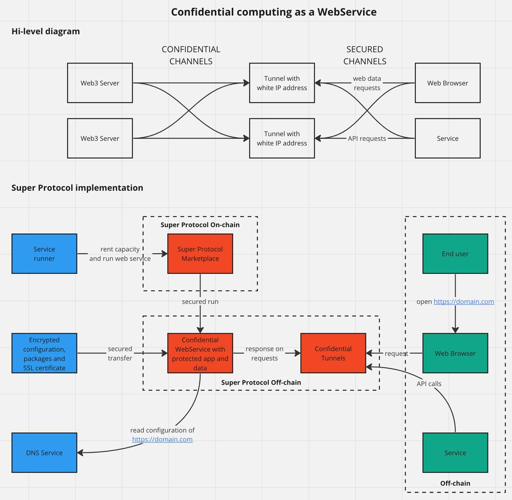

# Deployment of Node.js apps with Tunnels

intro

Super Protocol можно использовать для обеспечения конфиденциальных вычислений в качестве Web3 сервиса. При этом сервисы предоставляют точки доступа через механизм туннелирования, а внешние сервисы подключения с белыми IP-адресами также работают в защищенных контейнерах. Таким образов создается безопасный мост между Web3 сервисом и пользовательскими приложениями. 

При этом получение внешних данных и сохранение результатов происходит через распределенное хранилище в зашифрованном виде, используя асимметричное шифрование. Сам же процессинг происходит в изолированных и безопасных анклавах на основе аппаратных средств.

Конфиденциальный и защищенный каналы, предназначены для безопасного обмена данными между Web3 сервисами и внешними приложениями. Это обеспечивается использованием протоколов шифрования, таких как HTTPS, для защиты данных в процессе их передачи и защиты от атаки посредине, а также аттестацией каналов связи между компонентами туннелей.

Блокчейн маркетплейс Super Protocol выступает в качестве связующего звена между поставщиками вычислительных мощностей и потребителями услуг, упрощая процесс поиска и аренды необходимых ресурсов.

Для запуска своего решения нужно:

1.  Собрать свое решение, например на базовом образе NodeJs. Можно взять за основу пример с  [Майнкрафтом.](/developers/deployment_guides/nodejs_tunnels/minecraft)
    
2.  Сгенерировать сертификаты для разворачивания туннелей
    
3.  Создать заказ на аренду мощностей в Super Protocol и в качестве решения выбрать [туннель сервер](/developers/deployment_guides/nodejs_tunnels/manual_run#prepare-and-run-tunnel-server-solution).

4. Создать заказ на аренду мощностей в Super Protocol и в качестве решения выбрать [туннель клиент](/developers/deployment_guides/nodejs_tunnels/manual_run), а в качестве данных использовать свое решение.
    
5.  Дождаться запуска заказов и создать необходимые DNS записи для возможности работы туннелей. Если во время выполнения решения произошли какие либо ошибки, они также будут представлены в результатах или логах. Это очень удобно для аудита и отладки кода.

Для упрощения шагов по созданию заказа, нами были созданы Github Actions, которые вы можете найти в репозиториях с примерами.

## Examples

a few words about examples

### MineCraft

a few words about Minecraft example + link to the doc

### Super Chat

a few words about Superchat example + link to the doc
