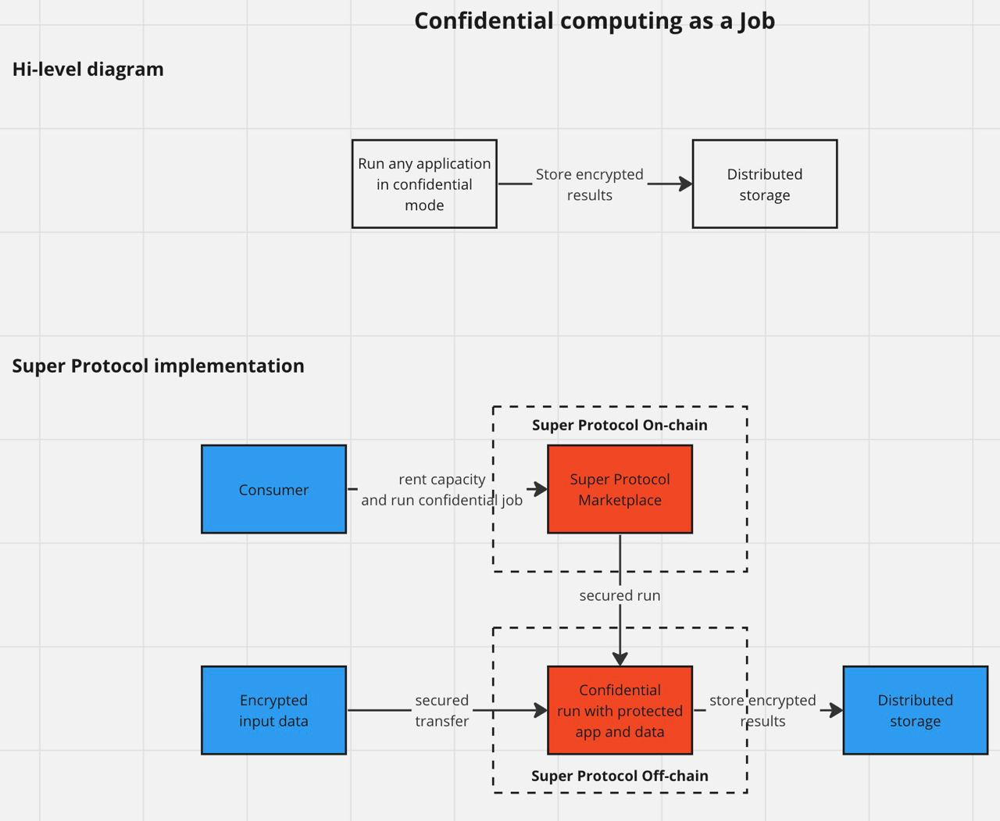

Одной из основных задач Super Protocol является процессинг данных в конфиденциальной среде. Как правило, он требуется в ситуациях, когда нужно обработать чувствительную информацию без риска ее утечки.

При этом получение внешних данных и сохранение результатов происходит через распределенное хранилище в зашифрованном виде, используя асимметричное шифрование. Сам же процессинг происходит в изолированных и безопасных анклавах на основе аппаратных средств.

Блокчейн маркетплейс Super Protocol выступает в качестве связующего звена между поставщиками вычислительных мощностей и потребителями услуг, упрощая процесс поиска и аренды необходимых ресурсов.

Для запуска своего решения нужно:

 1. Выбрать базовый образ, например Python, и создать выполняемый скрипт
 2. Создать заказ на аренду мощностей в Super Protocol и передать туда зашифрованный скрипт и данные (если это необходимо). Заказ можно создать как с помощью [CLI](/developers/cli_guides), так и с помощью [Маркетплейса](/developers/marketplace/).
 3. Дождаться выполнения заказа и получить результат из распределенного хранилища, в котором будут логи выполнения и файлы результата. Если во время выполнения решения произошли какие либо ошибки, они также будут представлены в результатах или логах. Это очень удобно для аудита и отладки кода.