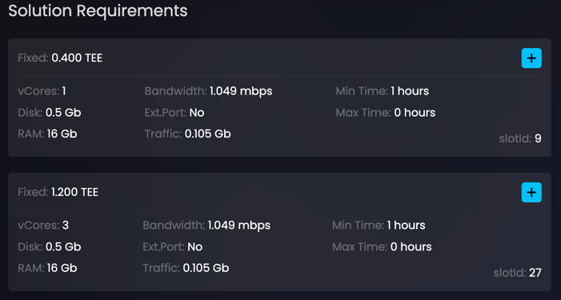
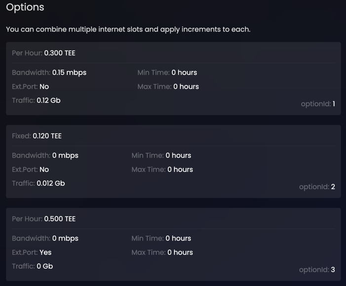
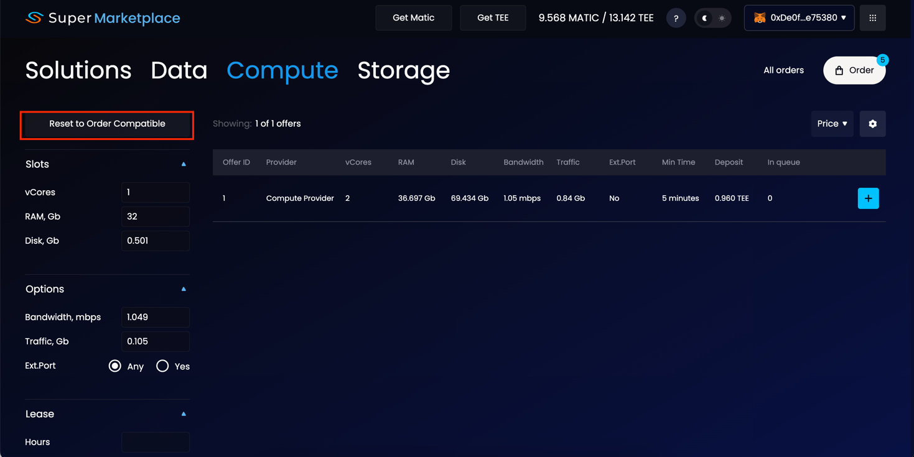

## Understanding slots

The name of this section should actually be Requirements and Configurations, but we refer to them collectively as *slots* because they all have to do with .....

slots system designed to leave the most flexibility to providers and customers in their choices.

<Highlight color="red">дописать</Highlight>

### Requirements

*Requirements* specify how much computing power and internet access is needed by solution and data offers to run properly. Requirements refer to a set of parameters that are determined by solution and data providers.

Requirements is also where the providers set the price for using their products. Price can be either for a one time payment, called *Fixed Price*, or - charged per hour of usage, called *Price Per Hour*. 

A single offer can have multiple sets of requirements. For instance, a Python script will compute faster on 4 CPU cores than on 2 cores. But because it would be computed faster, the price may reflect that. Or - providers may make their offer available as either fixed price or per hour, and leave it up for the customer to see which one makes most economic sense for their usage scenario. 

  

### Configurations 

The term *compute offer* refers to the resources of an entire machine, but in most cases a customer looking to deploy an order doesn't require the use of the whole thing. The system of *Slots* and *Options* - collectively known as a *Configuration* - enables compute providers to divide the finite resources of their machine into smaller "chunks" for better utilization.

Slots are the chunks of computing power (vCores, RAM, Disk) and Options are the chunks of internet access (Bandwidth, Traffic, Ext.Port). 

To ensure that the entire compute offer may be fully utilized, it is divided proportionally. So, if a compute offer is 24 vCore, 48 Gb RAM, and 960 Gb Disk, this divides neatly into 12 slots each measuring 2 vCores, 4 Gb RAM, and 80 Gb Disk each. These 12 slots can serve 12 simultaneous orders and utilize the machine fully. The compute offer can contain multiple such slots, so that the customer can choose the slot that is most appropriate for their usage scenario. Slots may be priced only per hour (no fixed price for computing) and only one slot may be selected.

Same logic as the above goes for options, with two exceptions: 
1. Options may be priced either as fixed price or per hour price;
2. Multiple options may be selected and each may be selected multiple times. 

Important: your compute configuration must be equal to or more than the sum of all requirements (solutions+data+storage). 

### Lease and Limits

Here we need to introduce another term: *Lease*, which is the amount of time for which you are renting solutions, data and compute offers. The lease value will determine how much deposit you will need to put up to create the order. Yes, you can always replenish the order later to extend its lease, but be mindful of the limits.

Requirements and configurations have parameters *Min.Time* and *Max.Time*, which specify the lower and upper limit on the amount of time that offers may be leased for - check for this, because if, for instance, a compute offer has a minimum lease time of 1 day and you need it for 1 hour, then the order won't start. 

## Auto-Select

There are many possible combinations of requirements and configurations, fixed prices and per hour prices, minimum and maxium time limits, but it's actually very easy to find the optimum configuration using automated *Auto-Select*.

In Marketplace GUI you simply select your offers and then select a desired configuration (all of them will meet your requirements). Additionally you can manually modify your Lease parameter. More on this in the [Walkthrough](/developers/marketplace/walkthrough).

For CLI you can just leave the slots and options fields blank and the auto-select will assign compatible configuration automatically. More on this in the [CLI workflows create](/developers/cli_commands/workflows/create) command.

## Parameters

The base parameters are the same for requirements and configurations. All parameters can be entered as fractions.

* *vCores* - CPU cores available for computations.

* *RAM* - RAM available for computations.

* *Disk* - SSD available for computations. 

* *Bandwidth* - Bandwidth available for download/upload of data to the TEE.

* *Traffic* - Traffic available for download/upload (this value decreases with use).

* *Ext.Port* - external port (for internet access). Yes / No.

* *Min. Time* - minimum lease time allowed.

* *Max.Time* - maximum lease time allowed.

* *Price Per Hour* - cost to the user for one hour of lease.

* *Price Fixed* - one time payment to lease for the duration of the order.

