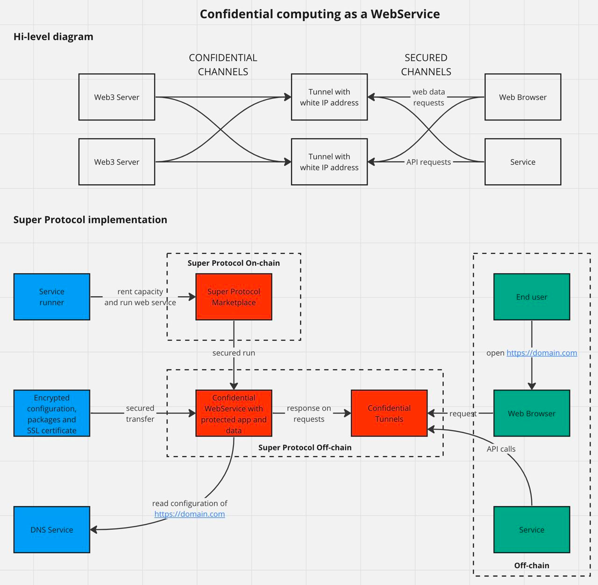

## Tunnels Overview 1

Super Protocol можно использовать для обеспечения конфиденциальных вычислений в качестве Web3 сервиса. При этом сервисы предоставляют точки доступа через механизм туннелирования, а внешние сервисы подключения с белыми IP-адресами также работают в защищенных контейнерах. Таким образов создается безопасный мост между Web3 сервисом и пользовательскими приложениями.

При этом получение внешних данных и сохранение результатов происходит через распределенное хранилище в зашифрованном виде, используя асимметричное шифрование. Сам же процессинг происходит в изолированных и безопасных анклавах на основе аппаратных средств.

Конфиденциальный и защищенный каналы, предназначены для безопасного обмена данными между Web3 сервисами и внешними приложениями. Это обеспечивается использованием протоколов шифрования, таких как HTTPS, для защиты данных в процессе их передачи и защиты от атаки посредине, а также аттестацией каналов связи между компонентами туннелей.

Блокчейн маркетплейс Super Protocol выступает в качестве связующего звена между поставщиками вычислительных мощностей и потребителями услуг, упрощая процесс поиска и аренды необходимых ресурсов.

## Tunnels Overview 2

IP-туннели — это технология, позволяющая обеспечить передачу сетевых пакетов между двумя (иногда более удаленными сетями) через другую сеть, такую как Интернет, используя IP-протокол. IP-туннели обеспечивают прозрачность маршрутизации и создают виртуальное сетевое соединение.

Если у веб-сервера нет белого (публичного) IP-адреса, а другой сервер имеет публичный IP-адрес, можно использовать технологию туннелирования для того, чтобы сделать контент доступным через сервер с публичным IP-адресом.

In Super Protocol two key components are used: the Tunnel Client and the Tunnel Server.

### Tunnel Server

(has public IP).

Server acts as a forwarding mechanism between the client and the external connections (such as web users).

A single tunnel server has the capacity to serve multiple domains and their corresponding tunnel clients concurrently. In situations where numerous tunnel clients connect to the same domain, the server utilizes a round-robin mechanism to evenly distribute requests among these clients.

### Tunnel Client

компонент который позволяет запустить локально веб сервер и связать его с туннель сервером.

папочки - это конфигруацинные составляющие клиента. Конткент веб сервера находится в /sp/content. В отдельных случаях это может быть перепределено.

(has no public IP)

The Client contains solutions and data while the

Для удобства и модульности, код веб-серверов разделен на две основные части: обычный веб-сервер и туннельный клиент. Это позволяет легче управлять и настраивать каждую часть независимо друг от друга и обеспечивает гибкость при необходимости изменений в будущем.

## Advantages

Схема с использованием туннелей имеет ряд преимуществ и может предоставить дополнительные уровни защиты. Ниже приведены некоторые из преимуществ и защитных мер, которые предлагает такая схема:

1. Скрытие внутренней сетевой структуры: Туннелирование скрывает структуру внутренней сети от внешнего мира. Это затрудняет проведение атак на внутренние ресурсы, так как атакующий не будет знать, какие сервисы находятся внутри сети.

2. Улучшенная безопасность: Туннелирование может использоваться в сочетании с шифрованием для обеспечения конфиденциальности и целостности передаваемых данных.

3. Уменьшение атак на веб-сервер: Так как веб-сервер без публичного IP-адреса доступен только через туннель, атакующий не сможет напрямую атаковать его. Атаки на уровне сети, такие как DDoS, будут направлены на сервер с публичным IP-адресом, что может помочь снизить риск воздействия на веб-сервер.

4. Гибкость и масштабируемость: Туннелирование позволяет гибко настраивать сетевую инфраструктуру и облегчает масштабирование системы. Сервера с публичными IP-адресами могут быть добавлены или удалены из системы без значительных изменений на веб-серверах без публичных IP-адресов.

