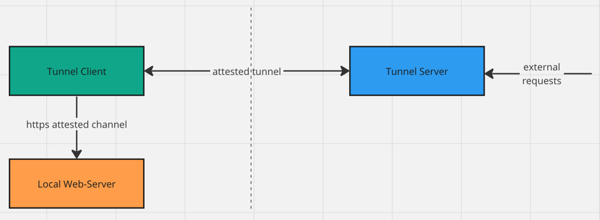
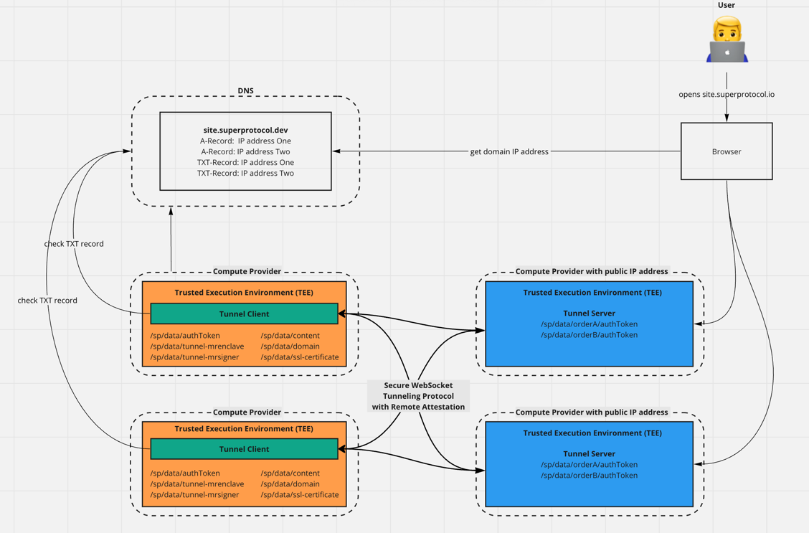

## Tunnels Overview

IP-туннели — это технология, позволяющая обеспечить передачу сетевых пакетов между двумя (иногда более удаленными сетями) через другую сеть, такую как Интернет, используя IP-протокол. IP-туннели обеспечивают прозрачность маршрутизации и создают виртуальное сетевое соединение.

Если у веб-сервера нет белого (публичного) IP-адреса, а другой сервер имеет публичный IP-адрес, можно использовать технологию туннелирования для того, чтобы сделать контент доступным через сервер с публичным IP-адресом.

In Super Protocol two key components are used: the Tunnel Client and the Tunnel Server.

### Tunnel Server

(has public IP).

Server acts as a forwarding mechanism between the client and the external connections (such as web users).

A single tunnel server has the capacity to serve multiple domains and their corresponding tunnel clients concurrently. In situations where numerous tunnel clients connect to the same domain, the server utilizes a round-robin mechanism to evenly distribute requests among these clients.

### Tunnel Client

(has no public IP)

The Client contains solutions and data while the

Для удобства и модульности, код веб-серверов разделен на две основные части: обычный веб-сервер и туннельный клиент. Это позволяет легче управлять и настраивать каждую часть независимо друг от друга и обеспечивает гибкость при необходимости изменений в будущем.



## Advantages

Схема с использованием туннелей имеет ряд преимуществ и может предоставить дополнительные уровни защиты. Ниже приведены некоторые из преимуществ и защитных мер, которые предлагает такая схема:

1. Скрытие внутренней сетевой структуры: Туннелирование скрывает структуру внутренней сети от внешнего мира. Это затрудняет проведение атак на внутренние ресурсы, так как атакующий не будет знать, какие сервисы находятся внутри сети.

2. Улучшенная безопасность: Туннелирование может использоваться в сочетании с шифрованием для обеспечения конфиденциальности и целостности передаваемых данных.

3. Уменьшение атак на веб-сервер: Так как веб-сервер без публичного IP-адреса доступен только через туннель, атакующий не сможет напрямую атаковать его. Атаки на уровне сети, такие как DDoS, будут направлены на сервер с публичным IP-адресом, что может помочь снизить риск воздействия на веб-сервер.

4. Гибкость и масштабируемость: Туннелирование позволяет гибко настраивать сетевую инфраструктуру и облегчает масштабирование системы. Сервера с публичными IP-адресами могут быть добавлены или удалены из системы без значительных изменений на веб-серверах без публичных IP-адресов.

## How it works



В этой схеме веб-серверы и браузеры используют разные типы DNS-записей для определения адресов публичных IP и маршрутизации трафика. Веб-серверы без публичного IP-адреса полагаются на TXT-записи для определения публичных IP-адресов туннелей, через которые они должны подключаться. Браузеры клиентов используют A-записи для определения публичных IP-адресов серверов туннелей.

Вот как работает эта схема:

1. Сначала осуществляется запуск необходимого количества веб-серверов и серверов туннелей.

2. В DNS создаются TXT-записи для каждого сервера туннеля с публичным IP-адресом. Эти записи содержат информацию о публичных IP-адресах в формате:

```
r=superprotocol;ip=10.5.0.5
```

3. В DNS создаются A-записи для каждого веб-сервера с публичным IP-адресом. Эти записи будут использоваться браузерами для определения IP-адресов веб-серверов.

4. Веб-сервер без публичного IP-адреса выполняет DNS-запрос, чтобы получить TXT-записи, связанные с публичными IP-адресами. Затем веб-сервер анализирует TXT-записи, чтобы определить параметры туннелей, через которые он должен подключаться.

5. Далее он устанавливает IP-туннель соединение к каждому из серверов с публичным IP-адресом, используя информацию, полученную из TXT-записей.

6. Клиентский браузер выполняет DNS-запрос для получения A-записи, связанных с доменом веб-сервера. Затем браузер использует полученный IP-адрес для подключения к веб-серверу.

7. Трафик от клиентских браузеров проходит через серверы с публичными IP-адресами и туннели к веб-серверам без публичных IP-адресов.

Эта схема позволяет веб-серверам без публичного IP-адреса использовать туннели для обработки клиентских запросов, при этом клиентские браузеры продолжают использовать стандартные A-записи для определения IP-адресов.


