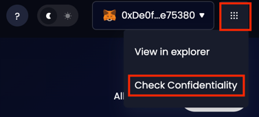
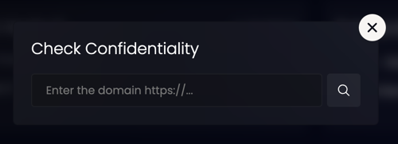
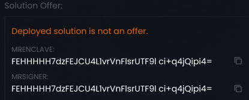
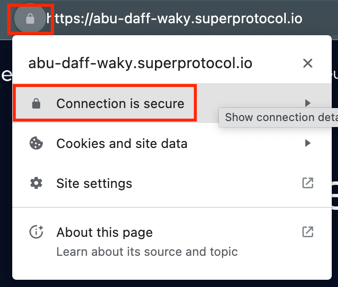
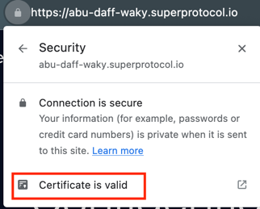
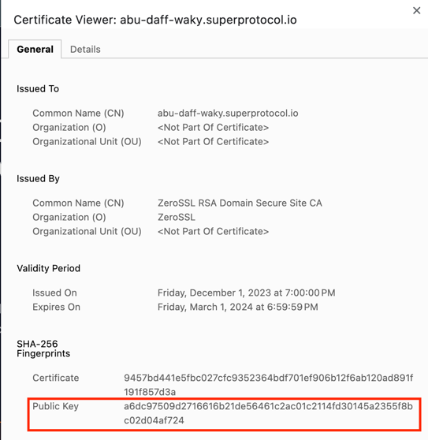

## Understanding quote verification

*Quote verification* is the process of verifying the authenticity and integrity of a TEE by examining the enclave *quote*. The SGX quote is a cryptographic data structure that provides proof of the enclave's identity and the measurement of its code and data. It is a critical element in the attestation process, enabling parties to establish trust in the execution environment.

In simple terms, quote verification allows to ensure that the contents of a domain are in fact running in a genuine confidential environment (TEE) and link the contents to Marketplace solution offers (if the contents are offers). 

For the moment quote verification is accessible only through the [Marketplace GUI](/developers/marketplace).

## How it works

### Getting there

Create a tunnels order using the [Marketplace GUI](/developers/marketplace/walkthrough) or [CLI](/developers/deployment_guides/tunnels). Your order result will be a domain address.

Go to the Instruments panel and select *Check Confidentiality*.

Enter your domain.

If the quote is verified, then you will see the results that look like this:

### Solution Offer

**Offer name and ID**

If the deployed solution is a Marketplace offer, then you will see its name, a link to the offer and the offer id.

You can download the Docker image file of the offer and compare its SHA-256 hashes with the source code of the offer available publicly. This way you will be able to verify the specific code that is running inside the TEE. This is useful of developers who want to achieve transparency of their deployed solutions and obtain trust of its users.

<Highlight color="red">Я не уверен в этом параграфе, как именно работает сравнение хешей? Хотелось бы пошаговый пример как сделать это на примере Супер чата</Highlight>
 
 
If the deployed solution is not from a Marketplace, you will see "Deployed solution is not an offer" text. This is not an error, just a warning that contents of the solution cannot be verified.

**MRENCLAVE**

"MRENCLAVE" is a value that represents the hash of the code and data inside the TEE (enclave). This measurement is used to uniquely identify the TEE and to ensure its integrity. It's a way to verify that the TEE being executed is the expected one and has not been tampered with.

**MRSIGNER**

The MRSIGNER value is used to uniquely identify the signing entity of the TEE. This is important for security purposes, as it helps in verifying the authenticity and integrity of the TEE. It ensures that the TEE was signed by the expected entity and has not been tampered with.

### Public Key Fingerprint

Super Protocol uses SSL/TLS certificates to encrypt the data exchanged between the user's browser and the web server inside the Tunnel Client deployment. The public key fingerprint is derived from the public key contained in the SSL/TLS certificate. You can verify the authenticity of the website by comparing the displayed fingerprint with an expected fingerprint, preventing possible man-in-the-middle attacks.

For the Chrome browser follow these steps:

If the public key in the browser matches the public key fingerprint, then the connection is secure.

