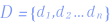
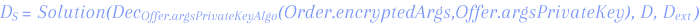

## Overview

**Super Protocol** consists of three layers: 

  

1. **Client Infrastructure.** At this layer there are applications for connecting to data provisioning services with integrated support for external APIs. The protocol SDK is used for exchanging requests with the blockchain in different programming languages.
2. **Blockchain Solution**. At this layer requests are received for confidential data processing and access to the provider's resources in order to get the results segments. This is where order payments and rewards are distributed, and staking takes place. It is implemented via the Super Protocol smart contract system. Super Protocol allows different blockchain networks to be interconnected and requests to be redirected to the main network so that a larger segment of participants can join in.

   The security is ensured through both the use of an individual public and private key pair and encryption of the network connection channel. The gateways and validator nodes provide additional security when transferring data between blockchain networks.

3. **Provider solutions.** Each solution includes an execution controller that allows processing and further distribution of requests from the blockchain. The main solution types are as follows:
   1. **TEE Provider.** The solution is used to fulfill orders for confidential execution within the TEE. The TEE Provider publishes the public key signed by the device in advance to enable trusted loader attestation.

      The Execution Controller receives the request for device allocation and solution execution. Then, the trusted loader is launched within the TEE. If the solution is encrypted, the loader decrypts it using the private key and then executes it.

      Once executed, the results are encrypted for the customer and stored in the selected data storage.

      The TEE provider also receives a fixed reward for online presence via the TEE Confirmation Protocol (see further sections).

   2. **Storage Provider.** The solution provides access to the data storage, usually distributed, such as Filecoin or Arweave. Scripts, applications, containers, solution execution results, among other things, can be stored in the data storage.

      The Execution Controller receives the request to allocate storage space and returns the encrypted storage access settings for the blockchain.

   3. **Data Provider**. The solution is used to provide the provider's data for processing. These processes are conducted in the TEE environment, which guarantees complete data confidentiality.

      The execution controller receives the request, checks the necessary dependencies (typically these would be the solution, TEE, and storage) and returns the URL of the encrypted data along with the key to then decrypt it into the blockchain. The key is encrypted with the trusted loader public key.

   4. **Solution Provider.** Solution Provider is responsible for various solutions such as scripts, applications, and containers.

      The Execution Controller receives the request for a solution and returns the URL of the encrypted solution along with the key to then decrypt it into the blockchain. The key is encrypted with the trusted loader key.

## Protocol Speed

Polygon has been chosen as the main network. Polygon supports the execution of up to [7,200 transactions per second](https://twitter.com/0xpolygon/status/1283467641076584448?lang=en). A minimum of 4 transactions is required to process one request. Thus, Super Protocol allows you to process up to 1,800 orders per second. There are no limitations on the data volume provided as the protocol allows the use of any file storage.

## Security

Since confidentiality is the core feature of Super Protocol, data is secured at all stages of processing.

The protocol also allows the content of the solutions to be hidden, if it is considered a trade secret. In this case, the Solution Provider can provide an encrypted solution.

If we consider the overall scheme of data transformation, we can distinguish the following levels:

1. **Client.** With apps, sites, and other secure access mechanisms, our customers obtain the outputs they need through requests to the blockchain layer. To protect the data, the customer provides the public key of the asymmetric encryption algorithm .

2. **Blockchain**. At this layer, the Super Protocol smart contracts are used to place value orders with their arguments encrypted with the  public key of the value provider's offer. Also, the offer determines the execution solution:

    (1)

    (2)

   Once the order is processed, the result is returned as access to the decentralized repository encrypted with the order's public key.

    (3)

3. **TEE**. This layer receives orders and obtains access to unprotected data  of the value provider.

    (4)

   All data processing (4) takes place at the hardware level in encrypted areas to guarantee confidentiality. In addition, each running TEE layer is remotely attested to ensure its integrity and protection against tampering.

   At this layer, data can be transformed by the operation of the solution (2), its startup parameters (1) decrypted using the private key of the order , and external data :

   

   All external operations, including temporary files  and storages , are performed in encrypted form using only the internally generated key  and symmetric algorithm :

    (6)

    (7)

   The output (5) is encrypted using the encryption algorithm  and the public key :

    (8)

4. **Decentralized storage**. All query results are stored in the distributed decentralized repository. The repository is accessed via the link  and the results are decrypted using the private key of the order :

    (9)

   Once the result is retrieved from the repository (8) using the link (9), it must be decrypted:

    