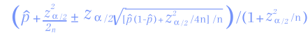
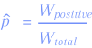

# Blockchain Solution

### Overview

.default%7D)

To ensure order processing, the blockchain environment provides an infrastructure with several smart contracts:

* **Basic smart contract for the Super Protocol Config system**
* **ERC-20 smart contract**
* **Smart contract for staking**
* **Provider Registry**
* **Value Offers**
* **TEE Offers**
* **Orders**

Now let’s take a look at each smart contract in detail.

### Basic smart contract for the Super Protocol Config system

It contains information on the other smart contracts in the system. This contract is used to update current information about the system and the system settings. It also contains a link to its later version, if it ever existed. The contract contains several system configurations:

**General smart contract configuration:**

| **Name**           | **Type** | **Description**                                                    |
| ------------------ | -------- | ------------------------------------------------------------------ |
| nextVersionAddress | address  | address of the latest version of the Super Protocol smart contract |
| providerRegistry   | address  | address of the provider smart contract                             |
| TEEOffers          | address  | address of the TEE offer smart contract                            |
| valueOffers        | address  | address of the value offer smart contract                          |
| orders             | address  | address of the order smart contract                                |
| tokens             | address  | address of the tokens smart contract                               |

**Provider offers configuration:**

| **Name**           | **Type** | **Description**                                                                                       |
| ------------------ | -------- | ----------------------------------------------------------------------------------------------------- |
| stopDelayDays      | number   | number of days from the moment the offer is declared irrelevant until it is no longer being processed |
| minSecDeposit      | number   | minimum balance of the provider's security deposit                                                    |
| offerSecDeposit    | number   | security deposit for the offer                                                                        |
| offerPenalty       | number   | amount of penalty for not fulfilling the offer                                                        |
| TEEOfferSecDeposit | number   | security deposit for the TEE offer                                                                    |
| TEEOfferPenalty    | number   | amount of penalty for not fulfilling the TEE offer                                                    |
| TEERewardPerEpoch  | number   | reward for all TEE resources per epoch equal to 24 hours                                              |

**Order configuration:**

| **Name**                | **Type** | **Description**                                                                                                        |
| ----------------------- | -------- | ---------------------------------------------------------------------------------------------------------------------- |
| orderMinimumDeposit     | number   | minimum deposit for each order. The remainder is refunded after the order is completed                                 |
| profitWithdrawDelayDays | number   | number of days from the moment the reward for the completed order or TEE is received until the reward can be withdrawn |

**Contract interface:**

| **Name**                                                      | **Access** | **Execution location** |
| ------------------------------------------------------------- | ---------- | ---------------------- |
| constructor(address owner)                                    | owner      | blockchain             |
| getSPConfiguration() public returns (SPConfiguration)         | any        | SDK                    |
| getOffersConfiguration() public returns (OffersConfiguration) | any        | SDK                    |
| getOrdersConfiguration() public returns (OrdersConfiguration) | any        | SDK                    |
| getPenaltiesCount(address provider) public returns (uint64)   | any        | SDK                    |

The smart contract makes it possible to set configurations.

### Staking smart contract

This smart contract allows tokens to be held for profit.

**Held tokens record structure:**

| **Name**       | **Type** | **Description**                                                                   |
| -------------- | -------- | --------------------------------------------------------------------------------- |
| owner          | account  | owner of the tokens                                                               |
| amount         | uint256  | number of held tokens                                                             |
| unholdDatetime | uint64   | point in time at which tokens can be released and transferred to the main deposit |

**Contract interface:**

| **Name**                                                                                                | **Access** | **Execution location** |
| ------------------------------------------------------------------------------------------------------- | ---------- | ---------------------- |
| lockTokens(Propose propose, address stakeOwner, uint256 amount, uin256 period ) external returns (bool) | system     | blockchain             |
| confiscateTokensFrom(Purpose executor, address stakeOwner, uint256 amount)                              | system     | blockchain             |
| unlockTokens(Purpose executor, address stakeOwner, uint256 amount)                                      | any        | blockchain             |
| stake(uint256 amount)                                                                                   | any        | blockchain             |
| unstake(uint256 amount)                                                                                 | any        | blockchain             |
| stakeFor(address beneficiary, uint256 amount)                                                           | any        | blockchain             |

Smart contract methods allow tokens to be stored so that they can later be released and rewarded for staking.

### Provider Registry

This smart contract contains information about providers, their properties, as well as some other information. In order to be included in the registry, the provider must pay the security fee, which is immediately transferred to the provider's deposit and further kept there.

**Provider record structure:**

| **Name**      | **Type** | **Description**                                                               |
| ------------- | -------- | ----------------------------------------------------------------------------- |
| authority     | account  | owner's account that can change the provider's record                         |
| tokenReceiver | account  | token recipient account for the data provider services                        |
| actionAccount | account  | active account that can add and modify offer records for a data provider      |
| name          | string   | name of the provider                                                          |
| description   | string   | description of the provider                                                   |
| metadata      | string   | metadata, which may contain additional properties, such as a link to the logo |

**Contract interface:**

| **Name**                                                    | **Access**         | **Execution location** |
| ----------------------------------------------------------- | ------------------ | ---------------------- |
| register(Provider provider) public returns (Provider)       | any                | blockchain             |
| refillProviderSecurityDeposit(uint amount) public           | provider.authority | blockchain             |
| returnProviderSecurityDeposit(uint amount) public           | provider.authority | blockchain             |
| modifyProvider(Provider provider) public returns (Provider) | provider.authority | blockchain             |
| get(guid providerId) public returns (Provider)              | any                | SDK                    |
| listAll() public returns (Provider\[])                      | any                | SDK                    |

Smart contract methods allow the registration of a provider and the modification of its properties.

.default%7D)

To be able to register, the provider accesses the provider registry smart contract and invokes the registration method. The provider has to pay the security deposit in the first place. If the security deposit decreases below the required level during the process (in cases where penalties have been applied and no replenishment has been made), all of the provider's offers cannot be used to create and fulfill the orders.

The _returnSecurityDeposit_ method allows the withdrawal of the entire remaining security deposit, provided that all offers (regular and TEE) of the data provider are disabled.

### Slots and options

The Slot, Option, and Usage entities are used to solve the problem of resource provisioning and utilization, as well as pricing:

.default%7D)

#### Slot

A slot is a minimal piece of equipment that is used to allocate capacity for order processing. The slot includes the following:

* **BCPUCores - the number of provided processor cores in the slot. The power of the cores is calculated using the consensus protocol**
* **RAM - the amount of provided memory in a slot in bytes. The memory speed is calculated using the consensus protocol**
* **SSD / HDD - provided capacity of SSD and/or HDD in a slot in bytes. Disk speed is calculated by consensus protocol**

#### Option

An option is an additional unit of provided equipment and services. The option includes the following:

* **Bandwidth of the network provided in the option in bps**
* **Maximum amount of traffic provided in the option in bytes**
* **External port, which is available for use/forwarding in the solution offer. If it's specified in the TEE offer, then it's a flag to provide an external (static) IP address for executing the order with any port bound**

Slots as well as options can be summed up (to be described later) and their sum represents the rented equipment for the execution of the order.

#### Usage

The _SlotUsage_ entity describes the usage scenarios of a slot or option. It includes the following:

* _**Price**_** is the price of use**
* _**PriceType**_** is a type of price, which can be **_**PerHour**_** (per hour) or **_**Fixed**_** (fixed price)**
* _**minTimeMinutes**_** is a minimum usage in minutes**
* _**maxTimeMinutes**_** is a maximum usage in minutes**

### TEE offers

This smart contract contains offers for the use of the TEE resource. In the Super Protocol system, the price for using TEE depends on the number of hours rented under the offer. One offer corresponds to one TEE device.

**Offer record structure:**

| **Name**          | **Type**                 | **Description**                                                                                                                                     |
| ----------------- | ------------------------ | --------------------------------------------------------------------------------------------------------------------------------------------------- |
| providerAuthority | address                  | unique provider identifier                                                                                                                          |
| id                | guid                     | incremental offer identifier. This identifier is unique for all types of offers, including value offers                                             |
| name              | string                   | offer name                                                                                                                                          |
| description       | string                   | offer description                                                                                                                                   |
| teeType           | string                   | TEE: CPU/GPU type                                                                                                                                   |
| hardwareInfo      | {SlotInfo; OptionInfo}   | complete specifications of the device, consisting of the slot and all available options as well as the price per hour. A fixed price is not allowed |
| slots             | \[{SlotInfo; SlotUsage}] | array of provided slots and their conditions of use. In the TEE offer, the price type of slots is always _PerHour_                                  |
| options           | \[{OptionInfoSlotUsage}] | array of provided options and their conditions of use                                                                                               |
| TCBId             | guid                     | TEE Confirmation Block                                                                                                                              |
| TLB               | binary                   | TEE Loader Block                                                                                                                                    |
| argsPublicKey     | string                   | public key and encryption algorithm for arguments in JSON format when placing an order for execution                                                |

**Contract interface:**

| **Name**                                                        | **Access**                   | **Execution location** |
| --------------------------------------------------------------- | ---------------------------- | ---------------------- |
| create(TEEOffer offer) public returns (TEEOffer)                | Provider.actionAccount       | blockchain             |
| setOfferName(uint256 offerId, string name)                      | offer.provider.actionAccount | blockchain             |
| setHardwareInfo(SlotInfo slot, OptionInfo option)               | offer.provider.actionAccount | blockchain             |
| addSlot({SlotInfo, SlotUsage}) returns slotId                   | offer.provider.actionAccount | blockchain             |
| updateSlot(slotId, {SlotInfo, SlotUsage})                       | offer.provider.actionAccount | blockchain             |
| deleteSlot(slotId)                                              | offer.provider.actionAccount | blockchain             |
| addOption({OptionInfo, SlotUsage}) returns optionId             | offer.provider.actionAccount | blockchain             |
| updateOption(optionId, {OptionInfo, SlotUsage})                 | offer.provider.actionAccount | blockchain             |
| deleteOption(optionId)                                          | offer.provider.actionAccount | blockchain             |
| setOfferPublicKey(uint256 offerId, string publicKey)            | offer.provider.actionAccount | blockchain             |
| setOfferDescription(uint256 offerId, string description)        | offer.provider.actionAccount | blockchain             |
| setTeeOfferTlb(uint256 offerId, string tlb)                     | offer.provider.actionAccount | blockchain             |
| getTEEsToConfirm() returns (guid\[])                            | offer.provider.actionAccount | blockchain             |
| enable(guid offerId)                                            | offer.provider.actionAccount | blockchain             |
| disable(guid offerId)                                           | offer.provider.actionAccount | blockchain             |
| listOf(guid providerId) public returns (TEEOffer\[])            | any                          | SDK                    |
| listAll(bool withDisabled = false) public returns (TEEOffer\[]) | any                          | SDK                    |
| get(guid offerId) public returns (TEEOffer)                     | any                          | SDK                    |

Smart contract methods allow the provider to create a TEE offer, modify it, or mark it as disabled. For registering each provider's TEE offer, a portion _TEEOfferSecDeposit_ of the security deposit is blocked. This is to ensure protection against spam attacks and operation of the TEE consensus protocol. If the available deposit amount is insufficient, the offer will not be registered.

.default%7D)

In order to add a new TEE offer, the provider accesses the TEE offer smart contract and invokes the offer creation method.

To provide hardware, the provider has to define a maximum configuration _hardwareInfo_, for example this could be as follows:

| **CPU** | **RAM** | **SSD** | **HDD** | **Bandwidth** | **Traffic** | **ExternalPort** |
| ------- | ------- | ------- | ------- | ------------- | ----------- | ---------------- |
| 24      | 512 Gb  | 2048 Gb | -       | 100 Mbit      | Unlimited   | True             |

It is also necessary to set options for the usage of the equipment through the setup of slots and options, for example it could be as follows:

**slots:**

| **slotId** | **CPU** | **RAM** | **SSD** | **HDD** | **Usage**        |
| ---------- | ------- | ------- | ------- | ------- | ---------------- |
| 1          | 3       | 64 Gb   | 256 Gb  | -       | 0.01 TEE PerHour |

**options:**

| **optionId** | **Bandwidth** | **Traffic** | **ExternalPort** | **Usage**      |
| ------------ | ------------- | ----------- | ---------------- | -------------- |
| 1            | 10 Mbit       | 1024 Mb     | -                | 0.01 TEE Fixed |
| 2            | 20 Mbit       | 1024 Mb     | -                | 0.02 TEE Fixed |
| 3            | -             | -           | True             | 0.1 TEE Fixed  |

For the most optimal use of the equipment, it is recommended to set slots and options that divide the overall configuration evenly.

Each TEE device participates in a validation protocol, in which all its characteristics are updated.

If the TEE device has not sent a TCB within 48 hours, it is removed from the list of active devices.

### Value offers

#### Overview

This smart contract contains offers for certain values. It is also possible to create a combined value using the required values of other types. For example, the provider allows its data to be processed by another provider's solution within a secure TEE area and the encrypted result is stored in the distributed storage.

The offer describes the cost of using it and the minimum order deposit. To maintain confidentiality, the arguments for offer execution must be encrypted. For this purpose, the public key of the asymmetric algorithm and the encryption algorithm itself are specified.

**Value offer record structure:**

| **Name**          | **Type**                             | **Description**                                                                                                                                                           |
| ----------------- | ------------------------------------ | ------------------------------------------------------------------------------------------------------------------------------------------------------------------------- |
| providerAuthority | address                              | unique provider identifier                                                                                                                                                |
| id                | guid                                 | unique offer identifier                                                                                                                                                   |
| group             | string                               | “INPUT”, “OUTPUT” or “PROCESSING” offer group                                                                                                                             |
| offerType         | string                               | offer type, e.g., "Storage", "Solution", "Data", etc.                                                                                                                     |
| cancelable        | bool                                 | flag regarding the possibility of canceling the order on this offer                                                                                                       |
| name              | string                               | offer name                                                                                                                                                                |
| description       | string                               | offer description                                                                                                                                                         |
| linkage           | string                               | linkage spec, for example, for docker                                                                                                                                     |
| restrictions      | string                               | possible restrictions and requirements for various provider offers. Used when creating an order. E.g.: ‘{“TEE”: \[GUID1, GUID2], “Storage”, “Solution”: \[GUID3, GUID4]}’ |
| slots             | \[{SlotInfo; OptionInfo; SlotUsage}] | array of provided configurations and conditions for their use                                                                                                             |
| input             | string                               | input data format                                                                                                                                                         |
| output            | string                               | output data format                                                                                                                                                        |
| allowedArgs       | dictionary                           | dictionary of allowed arguments in the following format: \[name:string, value: string\[]]                                                                                 |
| allowedAccounts   | account\[]                           | list of accounts allowed to place an order based on this offer. If the list is empty, all are allowed                                                                     |
| argsPublicKey     | string                               | public key and algorithm for encrypting arguments in JSON format when the order is being placed for fulfillment                                                           |
| hash              | string                               | hash and algorithm for non-encrypted result (if known beforehand) in JSON format                                                                                          |
| resultUrl         | string                               | final path for automatic generation of the result without mandatory fulfillment                                                                                           |

**Contract interface:**

| **Name**                                                                      | **Access**                   | **Execution location** |
| ----------------------------------------------------------------------------- | ---------------------------- | ---------------------- |
| create(Offer offer) public returns (Offer)                                    | Provider.actionAccount       | blockchain             |
| setOfferName(uint256 offerId, string name)                                    | offer.provider.actionAccount | blockchain             |
| setOfferPublicKey(uint256 offerId, string publicKey)                          | offer.provider.actionAccount | blockchain             |
| setOfferDescription(uint256 offerId, string description)                      | offer.provider.actionAccount | blockchain             |
| enable(guid offerId)                                                          | offer.provider.actionAccount | blockchain             |
| disable(guid offerId)                                                         | offer.provider.actionAccount | blockchain             |
| addSlot(SlotInfo slot, OptionInfo option, SlotUsage usage) returns slotId     | offer.provider.actionAccount | blockchain             |
| updateSlot(uint256 slotId, SlotInfo slot, OptionInfo option, SlotUsage usage) | offer.provider.actionAccount | blockchain             |
| deleteSlot(uint256 slotId)                                                    | offer.provider.actionAccount | blockchain             |
| listOf(guid providerId) public returns (Offer\[])                             | any                          | SDK                    |
| listAll(bool withDisabled = false) public returns (Offer\[])                  | any                          | SDK                    |
| get(guid offerId) public returns (Offer)                                      | any                          | SDK                    |

Smart contract methods allow the provider to create a script execution offer, modify it, or mark it as disabled.

_**In an offer, you can change everything except for the hash, if it is already set.**_

.default%7D)

For registering each provider's offer, a portion of the security deposit _offerSecDeposit_ is blocked. This is to ensure protection against spam attacks. If the available deposit amount is insufficient, the offer will not be registered.

In order to add a new offer, the provider accesses the offer smart contract and invokes the offer creation method. Each offer may impose restrictions on execution. For example, an offer for big data processing imposes restrictions on the solutions that are allowed to process that data, on the TEE that can be used for execution, and on the Storage for preparing the data to be processed.

If _resultUrl_ is set, then smart contract immediately executes the order.

#### Offer dependencies

Let us consider an example of offer dependencies based on a system of restrictions, starting from the basic data offer:

.default%7D)

The following restrictions are shown on the diagram:

* **Storage restriction.** The provider must save the order result to any storage (if the Storage list is empty) or to any storage from the list of restrictions (if the list is not empty).
* **Solution restriction on the data offer side.** The Data Provider must be processed by any solution (if the Solution list is empty) or by any solution from the list of restrictions.
* **Solution restriction on the Solution Provider side.** Solutions can be executed independently (if there are no restrictions) or by utilizing any base image from the list of restrictions.
* **Processing restriction.** The data or solution must be processed/executed in any TEE (if the TEE list is empty) or in any TEE from the list of restrictions.
* **Restrictions related to processed data.** The solution must process any data (if the list of data types is empty) or any data from the list of restrictions, e.g., {"Data" : \["mp4", "avi"]} meaning that only specified formats are allowed for data input.

This chain of possible restrictions allows the provided data to be processed without access to its original value.

In terms of offer groups, only the following restrictions are possible:

.default%7D)

1. The INPUT offer can restrict the list of supported PROCESSING, INPUT, and OUTPUT offers
2. PROCESSING (TEE) and OUTPUT offers cannot impose restrictions

### Orders

In order to execute a provider offer, an order should be created by using the appropriate smart contract. The order creator must choose offers also taking into account all restrictions and requirements the order possesses and pay a security deposit, which will be held for the duration of the order execution. During the order creation, the execution configuration and additional options are formed. The prices are copied from the chosen offers:

.default%7D)

#### Calculation of minimum deposit for an order

Since the price type comes in two kinds - fixed and hourly, the deposit calculation is performed as the sum of the calculations for each type of price.

If a slot or an option is linked to a fixed price when creating an order, then that price is the final price for the selected slot or option.

If a slot or an option is linked to an hourly price when creating an order, then the final price is determined by the formula as follows:

Price = _usage.minTimeMinutes_ \* usage.Price / 60

That way, by getting the price for the Virtual Machine and all the options, you can calculate a minimum deposit to fulfill the order.

However, it should be noted that the resulting deposit cannot be less than the minimum deposit for the order set out by the protocol - _orderMinimumDeposit_.

In the event that an order is created with suborders, the minimum deposit is equal to the sum of all minimum deposits of the suborders. In this case, the resulting amount also should not be less than _orderMinimumDeposit_.

In this case, the total deposit to be held is calculated according to the formula below:

Smart contracts control only the fact that the deposit is not less than _orderMinimumDeposit_, the rest of the control is done through the SDK and rental systems.

The results of the execution or encountered errors are later added up to the order by the provider. To maintain confidentiality, the arguments in the order must be encrypted using the public key specified in the offer. Also, both the result and the error string are encrypted using the public key of the result, which is specified in the order along with the encryption algorithm.

**OrderArgs public argument structure:**

| **Name**    | **Type** | **Description**                                                                                   |
| ----------- | -------- | ------------------------------------------------------------------------------------------------- |
| inputOffers | guid\[]  | INPUT offers are part of the overall processing. Set during the TEE order creation, if necessary. |
| outputOffer | guid     | offer selected by the customer to save the results of the order                                   |

**Order record structure:**

| **Name**            | **Type**      | **Description**                                                                                                                                                                  |
| ------------------- | ------------- | -------------------------------------------------------------------------------------------------------------------------------------------------------------------------------- |
| consumer            | account       | account of the offer consumer                                                                                                                                                    |
| offer               | guid          | unique offer identifier                                                                                                                                                          |
| id                  | guid          | unique order identifier                                                                                                                                                          |
| resultPublicKey     | string        | public key and algorithm used to encrypt the result in JSON format                                                                                                               |
| args                | OrderArgs     | public arguments are mainly used for processing within a smart contract                                                                                                          |
| encryptedArgs       | string        | list of arguments encrypted using the public key of the arguments specified in the offer                                                                                         |
| status              | string        | order status (suspended, blocked, new, processing, stopping, done, error, canceling, canceled)                                                                                   |
| encryptedResult     | string        | results of the order execution encrypted using the results public key                                                                                                            |
| orderPrice          | number        | current value of the order. Can be changed by the provider during processing                                                                                                     |
| depositSpent        | number        | amount of deposit spent. Can be changed by the provider during processing                                                                                                        |
| optionsDepositSpent | number        | The amount of deposit already spent on options. Can be changed by the provider during runtime. It makes sense for TEE orders so that the customer can see the additional expense |
| selectedUsage       | SelectedUsage | The structure in which the selected order parameters are stored when the order is created. **It is considered a smart contract and cannot be changed**                           |

**SelectedUsage:**

| **Name** | **Type**                   | **Description**                                   |
| -------- | -------------------------- | ------------------------------------------------- |
| vm       | {SlotInfo; SlotUsage}      | Total slot of the rented machine and price of use |
| options  | \[{OptionInfo; SlotUsage}] | Selected options and the price for their use      |

**Contract interface:**

| **Name and description**                                                                                                                                                                                                                                                                                                                                                                                                                                                                                                                                                       | **Access**                                               | **Execution location** |
| ------------------------------------------------------------------------------------------------------------------------------------------------------------------------------------------------------------------------------------------------------------------------------------------------------------------------------------------------------------------------------------------------------------------------------------------------------------------------------------------------------------------------------------------------------------------------------ | -------------------------------------------------------- | ---------------------- |
| **create(Order order, uint64 slotId, uint64 slotCount, \[{optionId: count}] options),uint256 deposit, bool suspended) public returns (Order)**                                                                                                                                                                                                                                                                                                                                                                                                                                 | any                                                      | blockchain             |
| Order creation. When this method is called, _Deposit_ is paid. The "suspended" status is necessary when blocking sub-orders need to be created before the order can be executed. The provider cannot execute the order until the order status is marked as "new".                                                                                                                                                                                                                                                                                                              |                                                          |                        |
| **createSubOrder(guid orderId, Order subOrder, uint64 slotId, uint64 slotCount, \[{optionId: count}] options), uint256 depositbool blockParentOrder) public returns (Order)**                                                                                                                                                                                                                                                                                                                                                                                                  | 
order.consumer

order.provider.actionAccount
 | blockchain             |
| Sub-orders are created by the customer (to assemble the entire order chain) or the provider (normally at the execution controller level). The Deposit specified when creating a sub-order is taken from the main deposit of the parent order and must not exceed it. In this case, the parental deposit is reduced by the transferred amount. Once created, such an order becomes a regular one. If _blockParentOrder_ parameter is set to true, the sub-order will block the main order if its status is "suspended" or "blocked".                                            |                                                          |                        |
| **start(guid orderId)**                                                                                                                                                                                                                                                                                                                                                                                                                                                                                                                                                        | order.consumer                                           | blockchain             |
| Updates the order status from "suspended" to "blocked" if there are blocking sub-orders, or to "new" if there are none.                                                                                                                                                                                                                                                                                                                                                                                                                                                        |                                                          |                        |
| **updateOrderPrice(guid orderId, uint256 orderPrice)**                                                                                                                                                                                                                                                                                                                                                                                                                                                                                                                         | order.provider.actionAccount                             | blockchain             |
| Order price update. The price may be higher than the original.                                                                                                                                                                                                                                                                                                                                                                                                                                                                                                                 |                                                          |                        |
| **updateOrderDepositSpent(guid orderId, uint256 depositSpent)**                                                                                                                                                                                                                                                                                                                                                                                                                                                                                                                | order.provider.actionAccount                             | blockchain             |
| Updates the deposit spent by the provider.                                                                                                                                                                                                                                                                                                                                                                                                                                                                                                                                     |                                                          |                        |
| **complete(guid orderId, status OrderStatus, string encryptedResult)**                                                                                                                                                                                                                                                                                                                                                                                                                                                                                                         | order.provider.actionAccount                             | blockchain             |
| Order completion. The results output or error values in the _encryptedResult_ parameter are assigned as required. After the method has been executed, the order is complete and nothing more can be done to it.                                                                                                                                                                                                                                                                                                                                                                |                                                          |                        |
| **cancelOrder(guid orderId) public returns(bool)**                                                                                                                                                                                                                                                                                                                                                                                                                                                                                                                             | order.consumer                                           | blockchain             |
| 
Request to stop execution of the order on the consumer's side. The order status is changed to "canceling", the provider saves the end result of the order and moves the order to "canceled" status. If the offer is of cancelable type, smart contract immediately refunds the remaining deposit based on the proportion of time running or <em>depositSpent</em>. If the offer is of non-cancellable type, the provider sets a fee for their work after the order is complete.

<em><strong>This method works only when all sub-orders are stopped.</strong></em>
 |                                                          |                        |
| **refillOrder(guid orderId, uint256 orderAmount)**                                                                                                                                                                                                                                                                                                                                                                                                                                                                                                                             | order.consumer                                           | blockchain             |
| Replenishment of the deposit by the customer. Normally required when renewing a rental. It can also be used to obtain additional results if that is supported by the provider’s offer.                                                                                                                                                                                                                                                                                                                                                                                         |                                                          |                        |
| **withdrawProfit(guid orderId) public**                                                                                                                                                                                                                                                                                                                                                                                                                                                                                                                                        | order.provider.tokenReceiver                             | SDK + blockchain       |
| Order profit withdrawal by the provider. Available after the order is executed. In this case, the profit is transferred to deferred payments for the number of days specified in the protocol settings (_profitWithdrawDelayDays_).                                                                                                                                                                                                                                                                                                                                            |                                                          |                        |
| **withdrawChange(guid orderId) public**                                                                                                                                                                                                                                                                                                                                                                                                                                                                                                                                        | order.consumer                                           | SDK + blockchain       |
| Deposit balance withdrawal by the customer. Available order execution and price update.                                                                                                                                                                                                                                                                                                                                                                                                                                                                                        |                                                          |                        |
| **getStatus(guid orderId) public returns (string)**                                                                                                                                                                                                                                                                                                                                                                                                                                                                                                                            | any                                                      | SDK                    |
| Retrieving the order status.                                                                                                                                                                                                                                                                                                                                                                                                                                                                                                                                                   |                                                          |                        |
| **getEncryptedResult(guid orderId) public returns (string)**                                                                                                                                                                                                                                                                                                                                                                                                                                                                                                                   | any                                                      | SDK                    |
| Retrieving the encrypted order result string (if present). It can be decrypted using the private key of _order.resultPublicKey_.                                                                                                                                                                                                                                                                                                                                                                                                                                               |                                                          |                        |
| **getOrderPrice(guid orderId) public returns (uint256)**                                                                                                                                                                                                                                                                                                                                                                                                                                                                                                                       | any                                                      | SDK                    |
| Retrieving the current or final price of the order.                                                                                                                                                                                                                                                                                                                                                                                                                                                                                                                            |                                                          |                        |
| **getDepositSpent(guid orderId) public returns (uint256)**                                                                                                                                                                                                                                                                                                                                                                                                                                                                                                                     | any                                                      | SDK                    |
| Getting the amount of the deposit spent.                                                                                                                                                                                                                                                                                                                                                                                                                                                                                                                                       |                                                          |                        |
| **setAwaitingPayment(uint256 orderId, bool value) public**                                                                                                                                                                                                                                                                                                                                                                                                                                                                                                                     | order.provider.actionAccount                             | blockchain             |
| Setting or resetting the awaiting payment flag to signal the need for a deposit replenishment.                                                                                                                                                                                                                                                                                                                                                                                                                                                                                 |                                                          |                        |
| **getAwaitingPayment(uint256 orderId) public view returns (bool)**                                                                                                                                                                                                                                                                                                                                                                                                                                                                                                             | any                                                      | SDK                    |
| Getting the awaiting payment flag.                                                                                                                                                                                                                                                                                                                                                                                                                                                                                                                                             |                                                          |                        |
| **setOrderMark(guid orderId, bool positive) public**                                                                                                                                                                                                                                                                                                                                                                                                                                                                                                                           | order.consumer                                           | blockchain             |
| Giving a positive or negative rating to the provider based on the completed order. This can be triggered an unlimited number of times, depending on how the provider deals with potential errors and inaccuracies in the order. However, any order can only have a single rating. The score is given to _offer.provider_.                                                                                                                                                                                                                                                      |                                                          |                        |
| **getProviderRating(guid providerId) public returns (fixed128x18)**                                                                                                                                                                                                                                                                                                                                                                                                                                                                                                            | any                                                      | SDK                    |
| Retrieving a provider rating based on the rating formula (described below).                                                                                                                                                                                                                                                                                                                                                                                                                                                                                                    |                                                          |                        |

.default%7D)

Smart contract methods allow anyone to create orders. When additional orders related to the main order are created, the _createSubOrder_ method is called with the main order ID passed as one of the parameters. This allows users to avoid paying for each sub-order as _Deposit_ already includes these fees.

The methods also allow both the provider to set a final order Price that does not exceed _Deposit_ and the customer to receive the change.

When creating a sub-order, the following procedure must be considered:

.default%7D)

1. The PROCESSING (TEE) group can only have a single OUTPUT sub-order, which is specified in the _args.outputOffer_ offer argument.
2. The PROCESSING (TEE) group can have any INPUT sub-order, which is specified in the _args.inputOffers_ offer list. However, INPUT offer restrictions must be respected.
3. The INPUT group offer can only have a single sub-order, which is from the OUTPUT group only. It is specified in the _args.outputOffer_ offer argument. However, INPUT offer restrictions must be respected.
4. The OUTPUT group can have no sub-orders.
5. When creating any order or sub-order, _args.outputOffer_ is specified to explicitly specify an offer for saving data.

#### Order state transition diagram

During processing of the order, its status is subject to change according to the diagram below. Also, to indicate the lack of a deposit, the _AwaitingPayment_ flag is used.

.default%7D)

#### Workflow

When creating a complex order with dependencies, the customer creates the main order (normally for TEE) and sub-orders. The customer sets up an offer for saving the result of the order in _args.outputOffer_. If the main order is created for TEE, the customer also configures all INPUT offers in the _args.inputOffers_ field:

.default%7D)

Let us consider different scenarios for using the ordering system.

#### Hardware rental

For hardware rentals, an order is created for the TEE offer and _args.outputOffer_ specifies the offer for OUTPUT, where the results will be uploaded to if needed. The number of rental minutes is also specified, and the customer pays for the entire period of time.

.default%7D)

Since we cannot rent a TEE alone, we have to choose a solution offer to run in it. If the solution uses a base image, such as Alpine, which is also represented as a solution offer, you need to specify it in _args.inputOffers_ as well. You can also pass a link to your own solution in the parameters instead of using solution offers.

An OUTPUT is specified for each solution, if required.

The customer executes the _cancelOrder_ method to terminate the hardware rental and the order is immediately terminated since all the TEE offers are of the cancelable type.

Rental can be renewed as follows:

1. The TEE provider initially assigns an awaiting payment flag to the order using the _setAwaitingPayment_ method and sets a new order amount
2. The customer pays the missing amount using the _refillOrder_ method

#### Algorithm for choosing a suitable TEE

If you need to create an order for a TEE offer, and there are several candidates (or the offer is not specified at all), you have to select one manually. To do this, the SDK uses an algorithm to select the suitable TEE:

1.  Firstly, all offers matching the TEE parameters are searched for. To do this, all properties of the INPUT solutions are analyzed, and their values are added together. These values must be less than those in the TEE offer:

    .default%7D)
2.  Secondly, in order to check TEE availability, the algorithm looks for the required number of available slots among suitable devices. If there are free slots available, this TEE offer can be used:

    .default%7D)

    If there are no available offers, the least loaded candidates are selected.
3. Thirdly, if there is more than one candidate, the selection is carried out randomly, so the TEE order is created, and the TEE is rented out.

#### Container infrastructure deployment

It is often necessary to deploy multiple containers on a single TEE device so that they can communicate with one another without the need for external access.

For example, we may want to deploy a DBMS container, a computing application providing a service to merge processed results, or a web server.

For this purpose, an order is created at the SDK level for the desired device with the total number of slots required in the "suspended" status. From there sub-orders are created for the desired containers. The order status is then changed to "blocked" until all sub-orders are completed.

### Example of Big Data Processing using the protocol

#### Timeline

For example, let us take a look at the Big Data Processing order cycle. Here is the diagram of the sequence of activities:

.default%7D)

Initially, the following participants are registered in the blockchain smart contract system:

* Provider offering solutions for data processing
* Provider offering TEE for confidential execution
* Provider offering storage for saving results
* Provider offering processing of their big data

These providers then create offers for execution. However, the data offer does impose limitations on the range of solutions that can work with it.

Also, if necessary, INPUT offers can limit OUTPUT (Storage) lists with respect to saving the results of the execution. This may be necessary if, for example, the solution is generated dynamically and written in encrypted form.

In order to get the result of data processing, the customer creates an order for a TEE offer in the "suspended" state and pays the _HoldDeposit_ described above. The customer also creates sub-orders for the data and solution and then runs the order for TEE.

Data and solution providers execute their orders by providing the respective data and solution in encrypted form for the trusted loader. After that, the TEE order is processed.

The TEE provider receives and executes the order by performing the following steps:

1. A trusted solution loader starts up.
2. The loader uploads the encrypted solution and data, decrypts the data, and runs the solution.
3. Once executed, the solution encrypts the result for the customer and saves it as a data segment.
4. The loader completes the TEE order.

The TEE provider then publishes the result and completes the order, and also the held tokens are distributed to the recipient.

#### Entity interaction in the Big Data Processing example

A complete structure of the big data processing order may look as follows:

.default%7D)

Each EXECUTION and INPUT offer here requires an OUTPUT to save the results of the corresponding order.

Let us take a closer look at the stages of interaction between the entities in this example:

.default%7D)

When a data processing customer creates an order on the blockchain network, they order TEE in the first place and from there create sub-orders for data and solution. The TEE order gets blocked until the sub-orders are successfully completed.

The execution controller on the data provider side receives this order and stores the segment for processing in encrypted form or alternatively provides a link to access the encrypted data.

Similarly, the execution controller on the solution provider side receives this order and stores the solution in encrypted form or alternatively provides a link to access the encrypted data.

The order for TEE is processed then. After receiving the order, the TEE execution controller downloads the encrypted solution and data and starts the trusted solution loader in the TEE area, which decrypts the keys, solutions, and data. The solutions are then launched along with the data in the TEE area.

Once executed, the results are encrypted and saved in the storage. The key itself is encrypted with the customer's public key using the DHIES algorithm. The TEE execution controller completes the order by storing the encrypted data link for the data provider:

.default%7D)

### Payment mechanism

.default%7D)

There is a deferred payment mechanism. It is configured within the smart contract of Super Protocol and usually equates to three months. This is necessary to ensure the continuous quality of service providers. Also, deferred payments are used to automatically replenish the security deposit when penalties are paid out of it.

### Penalty mechanism

.default%7D)

During the result update performed by the provider, the smart contract checks the error code and issues a penalty, if necessary. The penalty is paid out of the security deposit. Afterwards, the security deposit is automatically replenished by the deferred payments. It can also be replenished by calling the corresponding function in the basic Super Protocol smart contract.

The error code itself is signed inside TEE by the solution loader and ensures that the provider cannot change it. The provider can be penalized for delaying a request execution as early as during the smart contract check.

Each provider is responsible for the fulfillment of the assigned order. The providers of composite orders (with dependencies) are also responsible for providing the data and ensuring that it meets the declared parameters.

### Provider ratings

The smart contract for orders not only supports the assignment of a rating to a provider based on completed orders but is also capable of changing it, if necessary. This is done based on the lower bound of the [Wilson confidence interval](https://en.wikipedia.org/wiki/Binomial\_proportion\_confidence\_interval#Wilson\_score\_interval) for the Bernoulli parameter. The formula for the bounds of the confidence interval is the following:

Here  is the fraction of positive scores,  is the quantile  of the standard normal distribution, and  is the total number of scores.

This formula uses a weighting of scores based on the value of the completed order. The total weight of all orders will be calculated by the formula:

In this case, the weight of positive ratings will be determined as follows:

Based on this, the proportion of positive scores will be determined by the formula:

 should be used as the total number of scores.

When creating an order, the arguments must be encrypted with the _Offer.argsPublicKey_ using an asymmetric encryption algorithm as follows:

The provider also decrypts the arguments using their private key, processes the arguments inside TEE using a linked solution and encrypts the result with the public key of the order:

### Super Protocol roles

The table below shows the permissions to Super Protocol smart contracts depending on the user role:

| **Role**                | **ERC-20**          | **Staking**                                                             | **Provider Registry**                  | **TEE Offers**   | **Value Offers** | **Orders** |
| ----------------------- | ------------------- | ----------------------------------------------------------------------- | -------------------------------------- | ---------------- | ---------------- | ---------- |
| Token Holder            | Transfers, approves | Stakes                                                                  |                                        |                  |                  |            |
| Provider Authority      |                     | 
Manages provider registry record,

manages security deposit
 |                                        |                  |                  |            |
| Provider Token Receiver |                     | Receives rewards                                                        | Receives payments                      |                  |                  |            |
| Provider Action Account |                     | Manages offers                                                          | Manages offers                         | Processes orders |                  |            |
| Consumer                |                     |                                                                         | Manages order, manages payment deposit |                  |                  |            |

### Interaction between blockchains

Super Protocol supports the use of multiple blockchain networks simultaneously. One of the networks acts as the root chain with the smart contract processing system, while the others are child chains that pass both execution of transactions (through the messaging mechanism) and smart contract tokens to the root network and also in turn receive the results back.

The user can work with either network through the same smart contract interface.

#### Sidechain solution

.default%7D)

If Sidechain solutions are used, the entire logic is represented as an overlay on top of the blockchains. In order to pay for services in the Super Protocol system, the consumer uses tokens on the root network and wrapped tokens provided by Sidechain gateways on the child network.

In the case of Ethereum and Polygon networks, the [State Transfer](https://docs.polygon.technology/docs/develop/l1-l2-communication/state-transfer) mechanism is used for RPC.

#### Parachain

.default%7D)

In systems with parallel blockchain networks (Parachains), the interaction is already implemented at the level of the internal validation network (relay chain), so there is no need to wrap the token, and only RPC messages are transferred there. The [Polkadot](https://polkadot.network/technology/) network is one of the clearest examples of such solutions.
