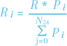

# TEE Confirmation Protocol
## Model overview
Each TEE device receives a fixed reward for being on the network. However, the following issues have to be solved:

1. You need to make sure that the TEE device really possesses all the compulsory features and can support confidential calculations.
1. You need to get the appropriate parameters for the TEE device in order to use it properly and pay the reward.
1. The TEE device has to be connected to the network and be ready to process the requests.
1. If there are any network intruders that pose as TEE devices, the system has to be able to identify and remove them with minimal inconvenience to honest devices.
1. The protocol has to operate within the smart contract system, which also imposes certain limitations.

## TEE Confirmation Block
The TEE Confirmation Protocol is designed as a solution to all the abovementioned issues. Its main component is the TEE Confirmation Block (TCB), which is obtained as a result of the **Confirmation Application** execution within the TEE:

  

The TCB consists of:

1. TEE Consensus Block that contains:
   1. Unique Device ID
   1. Equipment Benchmark Results
   1. Valid (confirmed) TCB IDs
   1. Invalid (declined) TCB IDs

1. TEE device Report that includes such key points as:
   1. Running Confirmation Application Hash
   1. TEE Consensus Block Hash

1. TEE Device Signature and certificate chains for signature verification

Created TCBs are written into the blockchain, but this is not a valid condition for their trustworthiness. In order to verify the TCB, you have to verify the report signature. This verification is carried out by the TEE devices during the Confirmation Application execution. The verification results for the evaluated TCBs are stored in a newly generated TCB of the verifying device. Thus, the continuous verification network is created.

In fact, the verification can be applied to the latest blocks as well as to other suspicious blocks in the network:

  

The technical limitations of the blockchain do not allow all the devices to verify all the blocks, which is why the Consensus Algorithm has been developed.
## Consensus Algorithm
The algorithm is implemented in the smart contract for TEE offers and cannot be applied to external data or carry out complex checks. That is why the consensus is based only on the received verification results performed by the TEE devices in TCBs.

To support the algorithm execution, the smart contract for TEE offers stores the following tables:

  

- Hash table (blocks registry) mapping blocks and rewards
- Table of the lastest TCBs for each device showing the number of positive and negative marks since the most recent block update
- Table of suspicious blocks with the total number of positive and negative marks

The Consensus Algorithm consists of the following steps:

1. **TCBs Generation.**
   1. The device accesses the smart contract to verify  blocks from the latest TCBs list and  blocks from the suspicious TCBs list.
      The total number of blocks to be checked equals .
    
      ***NB!*** *Due to the peculiarities of the blockchain implementation, the*  *blocks can be provided in segments via accessing the smart contract for several times.*
   
   2. The device launches the blocks verification application in the TEE and generates TCBs that contain the results for blocks verification and data on processing power. Such blocks are signed by the device.
      During the verification, the signature of each TCB is checked, as well as the hash of the Confirmation Application that was running on it.
   3. The device accesses the smart contract to store a new TCB.
2. **Keeping track of TCBs.** The smart contract takes TCB marks into account and carries out the following actions:
   1. Copies all the blocks that have not passed the verification (from the latest TCBs list) and puts them into the suspicious TCBs list.
   2. If the number of marks for the suspicious blocks equals some value , then the decision is made. The following condition is checked: if the number of the negative marks is higher than that of the positive ones, the block is considered to be **a malicious block**. Otherwise, the block is tagged as honest. After the decision is made, the block is removed from the suspicious TCBs list.
3. **Penalties for malicious providers.** If the block has been declared as a malicious block, then:
   1. It loses its reward. The reward is distributed proportionally to the processing power among the active devices in the system (within the last 24 hours).
   2. The device that has issued the block receives a penalty point.
   3. If the device receives  penalty points it is blocked without the possibility of being recovered. The security deposit is distributed proportionally to the processing power among the active devices in the system (within the last 24 hours). All the blocks issued by the device are removed from all the lists.
4. **Reward Payment.** The device receives a reward (unless it is blocked) according to the following formula:
   
   

   where:

    is the total reward for all the devices within the 24-hour period (established in the protocol settings), 
   
    is the power of the  device, 
   
    is the number of devices active within the last 24 hours.

   The reward is transferred to the security deposit of the device as a deferred payment. The staking rate is also calculated based on the reward.
## TCBs Generation
To receive a TCB, the Execution Controller of the TEE device queries (1) the blockchain network for other TCB blocks to verify and report on them. Among these blocks, the block belonging to the device is not submitted. Then the Controller runs the Confirmation Application (2) on the device, which performs the following actions:

- Checks hardware
- Checks TCB signatures on the certification service (3)
- Checks hash of the Confirmation Application running on the devices during TCBs generation
- Fills in the new TCB structure and signs it

  

After the application execution, the Execution Controller receives the result (4) and stores it in the blockchain (5) as the TEE Provider binds it to the TEE device. The device can only generate new TCBs once every 24 hours. If it attempts to access the smart contract earlier, it will not be able to receive blocks for verification or save a new block.

All the blocks submitted for verification are bound to the device and checked by the smart contract when receiving a new block.
## Keeping track of TCBs

  

When a new block is received, the smart contract updates the counter mechanisms for block verification and the performance characteristics of the device that sent the block.

If the negative mark is assigned to the last blocks, they are entered into the suspicious blocks table (unless they are already there and the device is blocked) without resetting the mark counter mechanisms. If the total number of verifications reaches a certain numberK. This allows the attacker's evaluation chain to be canceled even if the corresponding blocks have not first been verified by honest devices.

  

## Reward Payment
The device receives the reward proportional to its share of the total power of the devices active within the last 24 hours:

  

The corresponding record is added to the Blocks and Rewards Registry:

  

Each reward is transferred to the security deposit as a deferred payment. The staking rate is also calculated based on the reward.
## Possible attacks
The following attacks on the consensus protocol are possible:

1. Spam attack
1. False computing power attack
1. 51% attack

Let us consider each attack and how the consensus handles them.

**Spam attack**

The spam attack allows the attackers to flood smart contracts with fake devices. To ensure protection against this, the provider makes a security deposit, and a part of the deposit is reserved for the TEE offer registration. Tools such as garbage collection, which is used to remove unnecessary old entries in smart contracts on the blockchain and penalties for not fulfilling the orders are also utilized.

**False computing power attack**

The attacker introduces a block with a large amount of computing power in order to take away a significant portion of the reward from the network. To ensure protection against such attacks, the following algorithm is used. If a TCB computing power differs by more than 10% from the last value assigned to the device, the TCB is added to the list of suspicious blocks. In this case, the device does not participate in the consensus, and the TEE offer is not active.

  

Only after an end-to-end verification is done, the device is allowed to operate and evaluate other devices. Block marks with modified computing power are not taken into account.

**51% attack**

This attack involves the attackers gaining control of more than 50% of hashing power compared to honest devices.

To perform this attack, the adversary is required to register a TEE Provider and buy a lot of genuine TEE devices equal in number to those already registered. Once the devices have passed the verification, false blocks are generated to take over the network.

During this, the attacker will give positive marks to intruders and negative marks to honest devices in order to exclude them from the system.

The reward the attacker eventually receives would be twice as much as what they would have received from their devices. To mitigate the attempted attack, the adversary will be penalized for not fulfilling the orders. In addition, as the network grows, the cost of such an attack becomes sky-high.